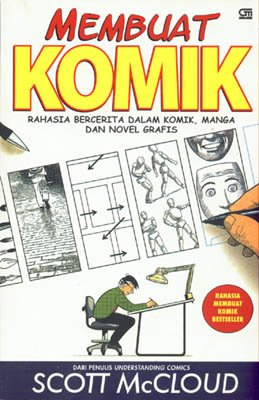

# Membuat Komik

scott mcloud njelasin cara bikin komik dengan metode sebuah komik..
dia bikin seorang tokoh yang njelasin ke pembaca tentang cara2 bikin komik..

yang seru lagi, dia ga menggiring pembaca utk ndalemin cara nggambar komik a la manga atau marvel (misalnya), tapi dia lebih nekenin ke cara pengembangan ide dan gimana nuangin ide itu ke dalam bentuk gambar dan layout yang disesuaikan dengan psikologi pembaca (disesuaikan dengan target pembacanya).. masalah gaya manga atau marvel atau apa pun, itu kembali ke selera masing2, bahkan dia mengajak untuk mencoba berbagai gaya2 gambar tersebut.

selain itu dia nggambarin konsep dasar dalam nyampein suatu ide lewat gambar, misalnya:
1) kondisi biasa/tenang/ideal dari mahluk hidup adalah simetri (kanan-kiri)
2) ekspresi2 dasar dan penggabungan beberapa ekspresi dasar
3) bahasa tubuh dan kaitannya dengan ke-simetri-an mahluk hidup
4) pilihan momen, bingkai, citra, kata, alur

yang gw tangkep sih, dalam buku ini juga memuat unsur2 psikologi pembaca, bahkan pembaca serasa bertemu langsung dengan si tokoh.. si tokoh seperti memiliki emosi yang sama dengan pembaca dalam menyampaikan maksudnya.. penempatan si tokoh menjadi bukan seperti seorang "guru yang kaku", tapi dia lebih terasa seperti seorang "teman yang lg sharing"..

secara keseluruhan, gw menilai buku ini bagus banget dan sangat layak utk dibaca sama siapa pun, baik yang mau ndalemin bidang komik/gambar maupun yg tidak..

Bergas Bimo Branarto,  
30 Juli 2008