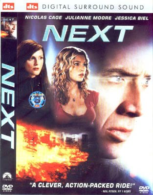

# Next

minjem filmnya teja,  
ceritanya tentang chris johnson (nicolas cage) yang punya kemampuan untuk "melihat dan merasakan" kejadian pada 2 menit ke depan.. dia kerja sebagai pesulap di sebuah tempat hiburan di las vegas, dia manfaatin kemampuannya untuk judi dan dapet uang secukupnya. suatu saat, dia lagi nuker uang hasil judi, dia dapet penglihatan ada seseorang dateng dan akan ngerampok teller tempat judi itu dan mbunuh si teller dan seorang polisi, sebelom hal ini kejadian, chris dgn sigap langsung nyerang si orang ini begitu orangnya dateng. 

petugas keamanan disana jelas ga tau klo orang itu bakal ngerampok, jadinya menurut mereka ya si chris lah yg salah (tiba2 nyerang), dia langsung dikejar2 sama keamanan setempat. tapi dengan kemampuannya yg mampu melihat ke depan, dia tau jalan mana aja yg harus dia lewatin dan waktunya kapan sehingga dia lolos terus dari pengejaran tanpa tergesa2.. selain itu, dia juga menggunakan kemampuannya itu untuk melacak sekelompok orang yang mau meledakkan los angeles yang juga menculik kekasihnya..

yah kira2 ceritanya tentang itu lah..  
ada yg aneh menurut gw:
1) kapan penglihatan 2 menit itu mulai bekerja? misalnya ada kondisi gw mau nyebrang jalan, kalo penglihatan itu mulai bekerja saat itu, gw akan tau dalam 2 menit ke depan gw akan ketabrak mobil atau ngga, klo ga bekerja ya gw ga akan tau (seperti biasa aja).
2) klo penglihatan itu bekerja setiap saat, berarti akan susah bedain mana yg visualisasi dan yang nyata (alam bawah sadar ga bisa bedain yg nyata dan maya).. dan jadinya pikirannya akan menghasilkan penglihatan yang berlapis2 dan dia ga akan fokus sama apa yg dia kerjain saat itu.
3) ada kejadian chris membelah penglihatannya itu, dia lagi mau nyari jalan, tiap ketemu jalan bercabang, dia membagi penglihatannya sesuai dengan jumlah percabangan.. hal ini akan bisa dilakukan jika dia punya daya ingat yang amat sangat tinggi sekali banget, karena cabang 2 berarti dia 2 kali "melihat", anggaplah kita ikutin percabangan ke kanan, di ujung kita bertemu 3 cabang, dan dia membelah penglihatannya lagi jadi 3 (total dia udah melakukan 4 penglihatan yang berarti 4 kali berpikir) dan seterusnya..
4) di akhir film, semua adegan yang telah terjadi ternyata hanya merupakan "penglihatan" dia, berarti hal itu juga mementahkan kemampuannya utk melihat sejauh 2 menit ke depan, karena kejadian yang terjadi di penglihatannya itu berlangsung hampir sehari penuh.. tanpa alasan yg jelas knapa dia akhirnya bisa "melihat" lebih lama dari 2 menit..

hmmm  
di luar itu smua,  
gw kebayang suatu hal,  
mungkin ga klo semua kejadian yang kita alami selama ini adalah imajinasi atau "penglihatan" seperti yang dialami oleh chris johnson?  

ternyata saat ini (pada kondisi sebenernya) kita masih ada di dalem rahim ibu dan menunggu beberapa detik lagi utk keluar dari rahim, dan sesaat sebelum keluar kita seperti diberi penglihatan tentang apa yg harus kita lakukan dalam hidup kita kelak..  

dan penglihatan itu lah yang saat ini sedang kita jalani.. kita dihadapkan dengan pilihan2 dan konsekuensi2 sampai pada akhirnya segala pilihan dan konsekuensi itu menuntun kita pada kematian.. dan pada saat kita "mati" itulah, sebenarnya kita telah selesai menjalani penglihatan tadi dan keluar dari rahim ibu.. lalu kita menjalani kehidupan yang sebenarnya dengan berbekal pada pilihan dan konsekuensi yang telah kita ketahui dari penglihatan kita sebelumnya..

jadi mati justru adalah saat kehidupan baru kita, mungkin di dunia dan dimensi yang lain...

hahahaha  
ngelantur deh..  

Bergas Bimo Branarto  
31 Juli 2008