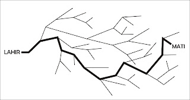

# Setting Up The Destiny

dengan hormat,
Bergas Bimo Branarto - 5:28 PM Sabtu, 16 Agustus 2008

"apa lu percaya takdir?"  
"takdir tuh udah ada, tinggal dijalanin.."  
"kita ga bisa menolak takdir, itu udah digariskan.."

digariskan.. garis..  

di gambar ada garis tipis dan ada garis tebal, garis yang tipis tuh bercabang2.. anggaplah itu adalah garis kehidupan, tiap percabangan adalah pilihan, dan setelah pilihan tersebut kita ambil, kita akan menjalankan konsekuensinya dan kembali akan muncul pilhan lagi, begitu terus berulang-ulang.. tentunya dengan pilihan yang berbeda dan konsekuensi yang berbeda juga..

jika kita anggap bahwa garis yang tebal adalah "jalan" atau "rangkaian pilihan" yang kita ambil dari awal sejak kita lahir sampai kita mati, apakah garis tebal itu yang disebut sebagai takdir? sesuatu yang telah digariskan?

mungkin begitu..

mungkin itu memang sudah digariskan, gw ga tau pasti soal itu..
tapi yang gw tau, dalam mencetak garis tebal itu, kita menghadapi pilihan2 sesuai dengan kondisi2 yang kita hadapi saat itu.. hampir tiap jam, mungkin tiap menit, kita akan berhadapan dengan berbagai pilihan yang harus kita ambil.. gw nulis ini juga setelah melewati proses memilih.. dan gw sedang memilih kata apa yang berikutnya akan gw tulis di sini..
begitulah, semuanya memang serangkaian pilihan..

sekarang gw duduk di depan komputer sambil membayangkan pilihan2 yang akan gw hadapi di depan sana.. sesuatu akan gw lakukan, akan ada konsekuensi dari apa yang telah gw lakukan itu, dan tiba pada pilihan berikutnya dan gw akan memilih lagi, lalu gw lakukan dan jalani pilihan gw itu, lalu gw jalani konsekuensinya lagi, dan selanjutnya dan selanjutnya.. trus gw tulis beragam pikiran yang berisi pilihan2 dan konsekuensi2 itu di ms excel dalam bentuk jadwal..

jadwal itu gw buat secara garis besar untuk 2 tahun ke depan, detail dari gambaran besar itu akan menyusul bertahap setiap bulan, tiap minggu, tiap hari, tiap jam, tiap menit dan tiap detik.. terus berlanjut selama 2 tahun ke depan..

yah, gw sedang membentuk takdir gw selama 2 tahun ke depan..
ko cuma 2 taun ke depan?? klo kelamaan capek ah mikirnya, ntar aja nyusul..
ga bermaksud nantang hal2 yang ga terduga, untuk hal2 ga terduga disiapin dalam hitungan menit atau detik.. atau milidetik?mikrodetik? nanodetik?ga tau lah..

mau ngutip kata2nya indiana jones di salah satu adegan dari film2nya (lupa film yang mana, yang pasti bukan yang baru), katanya:

"i never surprised, i'm a scientist"