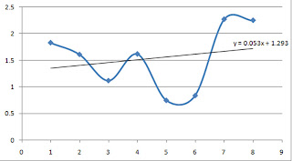

# The Journey Is Still On Progress

dengan hormat,
Bergas Bimo Branarto - 1:03 PM Sabtu, 16 Agustus 2008

turun-naik-turun-naik,  
ternyata perjalanan emosi seseorang bisa terlihat dari gejolak indeks prestasi yang diraihnya..

indeks prestasi??

yoa man, itu grafik perjalanan IP gw sejauh ini..
dulu sempet gw malu klo ditanya soal IP, tapi setelah dipikir2 ngapain juga malu, toh itu adalah bagian dari perjalanan yang telah gw tempuh dan masih akan berlanjut terus..

keterangan:  
1 = semester 1 04/05    
2 = semester 2 04/05  
3 = semester 1 05/06  
4 = semester 2 05/06  
5 = semester 1 06/07  
6 = semester 2 06/07  
7 = semester 1 07/08  
8 = semester 2 07/08  

grafik itu juga menunjukkan gejolak emosi yang gw rasain selama hidup gw di Institut Tai Banget.. gw baru flashback lagi perjalanan gw selama ini; ada waktunya gw lagi senang dengan berbagai permainan dan pekerjaan, ada waktunya gw jeprut dengan berbagai pikiran gw sendiri yang nyusahin diri sendiri.. dan memang seperti itulah perjalanan emosi gw yang (ternyata) mempengaruhi indeks prestasi akademis gw..

grafik itu juga membuktikan klo pergerakan emosi seseorang tuh mirip banget sama grafik sinusoidal yang berupa siklus naik-turun, tapi penggalan grafik itu nunjukinnya lebih mirip grafik cosinus sih.. selintas hal itu nunjukin ketidakstabilan, tapi sebenernya justru disanalah letak kestabilannya, terus naik-turun dengan irama yang (lumayan) berpola..

jadi inget komentar mantan kaprodi gw, klo ga salah pas perwalian menjelang semester ganjil 07/08, waktu gw bluffing, "semester besok saya akan dapet IP minimal 3 pak!". jawaban beliau, "saya orang fisika, kamu orang fisika, kita sama2 tau bahwa ga akan ada grafik yang patah!".. hahaha, dia benar!!!

bagi gw, grafik itu bukan menunjukkan aib.. justru grafik itu menggambarkan perjuangan. dan gw bangga dengan itu..

bah, perjuangan apa????
kalo diliat regresinya, grafik itu naik dengan tetapan kemiringan 0.053, kemiringannya (biarpun kecil) tapi terbukti meningkat..
beeuuhhh, pembenaran!!!
silakan komentar, silakan bilang itu pembenaran, kita liat aja nanti.. gw akan update grafik itu per semester, jadi bisa kita liat bareng2 perkembangannya..

yeahh!!!  
death or glory, journey to the end!!