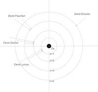

# Orbit Elektron Pada Atom?
dengan hormat,  
Bergas Bimo Branarto - 1:35 AM Minggu, 02 November 2008

> "Teori Bohr memperkenalkan atom sebagai sejenis miniatur planit mengitari matahari, dengan elektron-elektron mengelilingi orbitnya sekitar bagian pokok, tetapi dengan perbedaan yang sangat penting: bilamana hukum-hukum fisika klasik mengatakan tentang perputaran orbit dalam segala ukuran, Bohr membuktikan bahwa elektron-elektron dalam sebuah atom hanya dapat berputar dalam orbitnya dalam ukuran spesifik tertentu. Atau dalam kalimat rumusan lain: elektron-elektron yang mengitari bagian pokok berada pada tingkat energi (kulit) tertentu tanpa menyerap atau memancarkan energi."

http://www.chem-is-try.org/?sect=profil&ext=29

wah, anda salah besar bung..

“orbit atom” adalah suatu istilah untuk menggambarkan “posisi dimana elektron sering berada”. Elektron bergerak bebas, bergantung pada jumlah energi yang dimilikinya. Saat energi rendah, dia berada di dekat inti dan saat berenergi tinggi dia berada makin dekat dengan permukaan. Dia bergerak tidak hanya berputar pada orbit, tapi dia dapat bergerak pada berbagai bentuk lintasan.

Penelitian tentang elektron pada atom dilakukan dengan pengamatan. Pengamatan dilakukan seperti “memotret” atom beratus-ratus, bahkan berjuta-juta, kali dan hasil “foto” tersebut disatukan dan dilihat posisi terdapatnya elektron pada foto tersebut. Ternyata data penyebaran elektron paling banyak berada pada lingkaran-lingkaran yang akhirnya disebut sebagai “orbit”.

Jika tiap elektron yang terfoto digambarkan sebagai titik, hampir di semua tempat pada atom terdapat titik, dan titik-titik paling rapat berada pada daerah “orbit”, sehingga daerah itu membentuk pola lingkaran.

Jadi tampaknya amat-sangat-tidak-tepat-sekali-banget jika anda menganalogikan elektron pada atom seperti bumi pada tata surya.