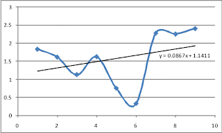

# Lanjutan Perjalanan

dengan hormat,  
Bergas Bimo Branarto - 12:04 AM Selasa, 20 Januari 2009

melanjutkan perjalanan,  
sebagai parameter lanjutan dari keberjalanan proses pengembangan yang terus menerus berjalan, berikut ini hasil dari perjuangan selama 6 bulan terakhir..

perjalanan dimulai dengan suatu kalimat yang diutarakan oleh diri sendiri dan ditujukan untuk diri sendiri: "pikirkan hanya yang perlu dipikirkan, lakukan hanya yang perlu dilakukan".

setelah berulang kali melakukan review, kesimpulan yang didapat dari kejadian-kejadian yang terjadi di taun-taun sebelumnya adalah gw berusaha menemukan diri gw di luar tempat gw berpijak. sebuah pijakan pasti akan memunculkan masalah-masalah sendiri, dan yan gw lakukan sebelumnya adalah mengacuhkan berbagai masalah itu dan mencari masalah baru di luar pijakan awal, mungkin bisa dibilang sangat bodoh..

akhirnya gw cukup berhasil untuk bersikap realistis. masalah-masalah lama yang tertunda dan makin bertumpuk lama-kelamaan menyadarkan gw arti dari sebuah tanggung jawab. tanggung jawab untuk menyelesaikan apa yang udah gw mulai. menyelesaikan pilihan awal gw. baik gw suka atau pun tidak, itu adalah hasil pilihan gw sendiri yang jelas harus dipertanggungjawabkan terhadap diri gw sendiri.

dengan titik kesadaran itulah, akhirnya grafik ini dihasilkan..

emang ga sempurna, tapi terbukti membaik dibanding titik-titik sebelumnya.
titik itu emang merupakan rata-rata dari semua titik-titik kecil yang kuambil di semester ini, ga semuanya berjalan mulus, masih ada satu titik kecil yang mengganjal. hal ini menjadi bagian dari evaluasi berikutnya.

tapi sejauh ini, terlihat peningkatan dari kemiringan 0.053 menjadi 0.0867. peningkatan ini dapat dilihat dari sudut pandang emosi yang meningkat kestabilannya dan pikiran yang semakin terkendali.

semoga memang begitu adanya.