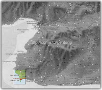
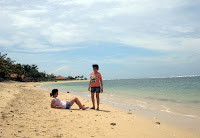
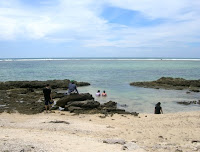
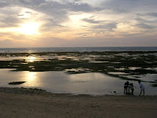

# Trip Ujung Genteng, Jawa Barat

dengan hormat,  
Bergas Bimo Branarto - 12:10 AM Senin, 19 Januari 2009

perjalanan dimulai tanggal 14 januari 09 jam 17.30, setelah seharian nunggu temen rombongan yang nyelesein dulu tugas kuliahnya, akhirnya kami berenam berangkat dengan mobil kijang.

rute perjalanan: bandung - cianjur - sukabumi.

sampe sukabumi kami berenti makan malem dulu trus lanjut lagi rutenya: cidadap - pasawahan - jampangkulon - surade - ujung genteng.

kurang lebih sepanjang perjalanan di daerah pasawahan - jampangkulon tuh tebing-tebing, jalan naik turun, belok-belok. lebar jalan kira-kira pas 2 mobil (kebayang jadinya kalo papasan sama bis/truk) trus jalannya juga banyak lobang di aspal. untuk keamanan, kecepatan rata-rata kami di jalur ini cuma sekitar 30-40 km/jam.

sampe di ujung genteng kira-kira jam 00.20 tanggal 15 januari 09, berarti perjalanan sekitar 7 jam lah. setelah masuk ke penginepan yang udah dibooking sebelumnya, masukin barang-barang lalu beranjak ke pantai.

ternyata di pantai ini banyak banget anjing. awal nyampe pantai udah disambut sama seekor anjing, trus nyusul satu lagi, satu lagi satu lagi dan satu lagi.. terus aja.. untungnya anjing disana ga terlalu galak, malah cenderung "ramah" ke pendatang. pantainya asik, pasirnya putih, banyak karang kecil-kecil, pantainya juga luas bgt. dan yang bikin gw ngerasa sangat beruntung adalah cuaca yang cerah, padahal kata penduduk disana beberapa hari sebelumnya tiap hari tuh ujan. setelah mulai masuk angin akhirnya kami balik ke penginepan dan tidur.

paginya sebelom mulai beraktivitas, kami sarapan dulu. utk menghemat budget kami berusaha ga beli makanan disana tapi
bawa bahan makanan sendiri dari bandung, jadi pas disana kita cuma beli nasi putih. lauknya dimasak sendiri. di penginepan udah disediain kompor dan bisa minjem wajan.

akhirnya siang itu kita habisin dengan jalan-jalan nyusurin pantai sambil foto-foto. menariknya, ada spot di pantai yang merupakan pertemuan jalur sungai ke laut, sayang banget kayanya ga ada yg ngambil fotonya nih.

di pinggiran pantai itu juga banyak karang-karang yang jadi rumah buat kepiting-kepiting, dan asiknya karang ini ga terlalu tinggi jadi kita bisa duduk-duduk disana sambil ngeliat langsung ke arah samudera hindia.

setelah jalan-jalan, duduk-duduk, main air dan ngitemin badan sampe bosen, kami mulai nyari objek berikutnya yang bisa didatengin. kebetulan di depan penginepan kami tuh ada warung jadi kami nanya-nanya disana.

ternyata ada pantai lagi yang viewnya lebih bagus dan pantainya lebih aman untuk berenang, yaitu pantai panarikan (kurang lebih 6 km utara pantai ujung genteng). di pantai ujung genteng ini banyak binatang yang cukup bahaya kalo kesentuh (misalnya: bulu babi). selain pantai panarikan, ada lagi pantai pangumbahan yang pasirnya halus dan dipakai oleh para penyu untuk bertelor, jaraknya kurang lebih 5 km utara ujung genteng. menurut anjuran orang warung, asiknya ngeliat sunset di panarikan trus jam 8 malem liat penyu bertelor di pangumbahan.

track menuju dua pantai itu ga bisa ditempuh pake mobil karena ada jalan yang anjlok karena cuaca dan ditutup demi keamanan. orang warung menawarkan jasa ojek. awalnya kami berencana untuk jalan kaki nyusurin pantai sampai ke panarikan dan pangumbahan, ternyata rencana itu terpaksa batal karena ada dua orang yang sakit (mungkin kecapean dan shock karena perubahan suhu yang drastis).

akhirnya sore itu kami ngliat sunset di pantai ujung genteng aja. pas nyampe pantai lagi, kami cukup terpukau sama keadaannya. laut yang tadinya cukup mempersempit garis pantai ternyata surut sampe jauh banget. ternyata di balik air laut yang kita lihat siangnya tuh ada "dataran rumput laut" yang lumayan jauh.

binatang-binatang laut juga bisa dilihat di daerah rumput laut ini. ada bulu babi, ada mahluk entah apa yang warnanya item ngumpet di dalem pasir, mungkin mirip bintang laut tapi di ujung-ujungnya tuh bentuknya kaya kaki seribu (nah lo, bingung kan?? sama dong). begitu kesentuh binatang itu langsung ngumpet ke dalem pasir, kalo pasirnya digali kayanya dia juga ikutan nggali lebih dalem lagi, jadi ga ketemu-ketemu deh.

ternyata sunset di ujung genteng udah keren banget, jadi mbayangin kaya gimana suasana sunset di panarikan yang katanya lebih keren dari ujung genteng itu.

setelah mulai gelap kami balik ke penginepan lagi untuk makan. kawan kami yang sakit itu belum sembuh juga, jadi akhirnya kami memutuskan untuk naik ojek aja ke pangumbahan untuk ngeliat penyu. biaya ojek ini lumayan mahal juga sih, 40 ribu, tapi si ojek nungguin terus dari berangkat sampe selesainya kita nonton penyu bertelor. foto-foto penyu masih ada di salah satu anggota rombongan (baca: endira, woy bagi dong foto2nya atau nggak upload lah di fb!!!)

besok siangnya, gw jalan nyusurin pantai sendiri, kebalikan arah penyusuran kemarinnya. gw ketemu tempat parkir perahu nelayan-nelayan. selebihnya, emang sepanjang pantai itu pemandangannya ga beda jauh sama pantai yang persis di depan penginepan gw. akhirnya gw balik lagi ke penginepan dan check out jm 15.30.

perjalanan pulangnya kami ga lewat track yang sama dengan pas berangkat. kali ini rutenya: ujung genteng - surade - pasawahan - cimenteng - bojonglopang - cikembar - sukabumi. sepanjang rute pasawahan-cikembar pemandangannya jauh lebih bagus daripada track pasawahan-cidadap. di track ini tebing-tebingnya keliatan lebih curam (sebenernya lebih rawan sih) tapi banyak ngelewatin kebun teh. suasananya mirip suasana di puncak, cuma jalannya lebih kecil. kami nyampe di bandung lagi jam 22.30-an, kira-kira track berangkat dan track pulang makan waktu yang sama, yaitu 7 jam.

walaupun ada beberapa objek yang ga sempet kami datengin, tapi after all untuk gw pribadi, gw cukup puas dengan perjalanan ini. pemandangan di pantai ujung genteng aja udah mantep banget dan sangat bisa merefresh otak yang penat abis ujian. apalagi ditambah dengan fenomena cuaca cerah selama kami disana (sama sekali ga ada ujan) yang bikin pemandangan khas pantai bisa kami lihat tiap saat.