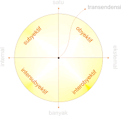

# Sintesa Integralistik

dengan hormat,  
Bergas Bimo Branarto - 5:55 AM Senin, 25 Mei 2009

## PENDAHULUAN

Sains dan filsafat berkembang sepanjang jaman dengan saling beriringan. Perkembangan sains memicu perkembangan filsafat dan sebaliknya. Dimulai dengan pandangan filsafat Barat yang mengatakan bahwa alam semesta dan segala entitasnya merupakan suatu tubuh mekanis tanpa jiwa dan teramati oleh manusia yang berpikir. Descartes menambahkan suatu sifat dualism pada tiap manusia yaitu antara pikiran dan fisiknya. Kemudian Newton mendukung teori itu secara matematis dengan persamaan mekanikanya. Paradigma positivisme tersebut bertahan lama sampai akhirnya munculah teori relatifitas oleh Einstein. Relatifitas Einstein menyatakan bahwa obyek yang teramati adalah relatif terhadap posisi pengamatnya. Selain itu muncul pula teori kuantum dan genetika yang secara umum mengatakan bahwa alam semesta memiliki sistem yang non-mekanistik.

Perkembangan ini memunculkan suatu aliran filsafat baru yang mementahkan sifat dualisme. Paham ini, paham holistik, memperkenalkan gagasan trans-substansial yang memadukan antara kesadaran dan materi. Paham ini melihat dunia sebagai sebuah kompleksitas dari berbagai entitas yang berbeda. Paham holistik menuntut adanya pembuktian dan fakta empirik untuk menyatakan kebenaran dari suatu realitas, hal ini masih sama dengan positivisme. Tetapi dalam perkembangannya, teori ini tidak dapat menjelaskan seluruh fenomena yang ada, khususnya yang berhubungan dengan sisi imajiner dari kompleksitas semesta.

Kondisi itulah yang akhirnya memicu para filosof untuk mencari suatu paradigma baru yang memasukkan kondisi imajiner yang sempurna dan merupakan pusat dari berbagai perbedaan dari tiap entitas. Paradigma ini dinamakan paradigma integralistik. Secara umum teori integralistik dapat dinyatakan sebagai kesatuan yang seimbang dan terdiri dari berbagai entitas. Entitas dapat merupakan sifat yang berbeda satu sama lain, tetapi tidak saling menghilangkan justru saling melengkapi dan saling menguatkan. Hal ini mirip dengan teori holistik. Yang membedakan antara integralistik dangan paham holistic adalah tuntutan untuk menuju kesadaran transendental bagi tiap-tiap entitas.

## SINTESA INTEGRALISTIK
### Latar Belakang
#### Paradigma Positivisme
Kehidupan masyarakat modern sangat dipengaruhi paradigma Cartesian-Newtonian yang dipengaruhi oleh pemikiran Descartes dan Newton. Descartes menyatakan bahwa dunia ini ada dan berpusat pada manusia yang berpikir. Kebenaran menurut Descartes adalah segala sesuatu yang bisa dinyatakan dalam persamaan matematika, yaitu berupa sistem mekanis. Newton melengkapi pemikiran Descartes dengan sebuah teori mekanikanya yang termatematisasi dengan metode eksperimen sebagai penguat argumen matematisnya, sesuai dengan pemikiran Bacon. Dari pemikiran-pemikiran ini, dapat disimpulkan beberapa sifat paradigma modern yaitu: Subjektivisme-Antroposentristik, Dualisme, Mekanistik-Deterministik, Reduksionisme-Atomistik, Instrumentalisme, Materialisme-Saintisme.

Paradigma di atas bertahan selama ratusan tahun hingga muncul penemuan teori relativitas, teori kuantum, genetika, biologi molekuler yang memungkinkan terjadinya system non-mekanistik. Perkembangan sains ini telah berimplikasi pada tatanan filosofis dengan adanya pemikiran pospositivisme yang salah satu variannya adalah munculnya paradigma holistik.

#### Sintesa Holistik
konsolidasi antara kesadaran dan materi merupakan paham yang bertolak belakang dengan paham dualisme dan terbentuk suatu paradigma baru yang disebut paradigma holistik. Filsuf Persia yang hidup sejaman dengan Descartes, Mulla Shadra, memperkenalkan gagasan gerak trans-substansial yang menyatukan Kesadaran-Materi. Metafilsafatnya didasarkan atas eksistensi (wujud) sebagai satu-satunya konstituen realitas. Eksistensi identik dengan realitas, sedang esensi atau kuiditas hanyalah kontruksi mental. Sistem ontologi Sadra didasarkan atas tiga prinsip utama yaitu:
1) primasi eksistensi
2) gradasi eksistensi
3) gerak trans-substansial

Prinsip primasi eksistensi memandang eksistensi sebagai satu-satunya realitas substantif. tidak ada dualisme eksistensi-esensi dalam realitas, dualisme itu hanya muncul dalam pikiran. Gradasi eksistensi menghargai keunikan segenap modus-modus eksistensi yang nampak dalam dunia plural (beragam). Gerak trans-substansial menyatakan bahwa tidak ada ruang dan waktu yang eksis secara independen, tetapi keduanya merupakan fungsi-fungsi atau aspek-aspek gerak kontinu yang terintegrasi. Gerak trans-substansial itulah yang menjembatani kesadaran dan tubuh kita.

Alfred North Whitehead mengemukakan pandangan organisme dalam kosmologi yang didasarkan pada beberapa konsep dasar yaitu: 
1) satuan-satuan aktual
2) proses organis
3) prinsip relativitas
4) kreativitas
5) pansubjektivisme

Secara umum semua yang ada di dalam dunia merupakan satuan aktual yang saling berkaitan satu sama lain.

pandangan kedua orang ini yang membetuk suatu paradigma holistik, yang dalam perkembangannya akhirnya melahirkan paham humanisme karena sifatnya yang menerima perbedaan sebagai bagian dari satu kuantitas semesta.

#### Kritik terhadap Sintesa Holistik
Dalam sintesa holistik, semua kuantitas satuan aktual berada pada tingkatan yang sama di dalam dunia semesta. Sintesa Holistik tidak mengenal fase transenden, sehingga konsekuensinya tidak dikenal adanya prima causa dan hirarki. Pengaruh filsafat modern masih cukup terasa dalam lingkup semesta, dimana suasana materialisme masih terasa untuk menyatakan eksistensi dengan mengabaikan fenomena-fenomena imajiner atau transenden.

### Pokok Pikiran Sintesa Integralistik
Secara umum teori integralistik dapat dinyatakan sebagai kesatuan yang seimbang dan terdiri dari berbagai entitas. Entitas dapat merupakan sifat yang berbeda satu sama lain, tetapi tidak saling menghilangkan justru saling melengkapi dan saling menguatkan. Hal ini mirip dengan teori holistic. Yang membedakan antara integralistik dangan paham holistic adalah tuntutan untuk menuju kesadaran transendental bagi tiap-tiap entitas.

Paham integralistik melihat kehidupan semesta sebagai sebuah kompleksitas yang harus dihadapi dengan adanya interkoneksitas dari berbagai entitas-entitas yang bervariasi, termasuk di dalamnya antara sains dan agama. Berangkat dari titik tersebut, muncul beberapa pertanyaan seperti: interkonteksitas tersebut akan mengarah kemana? Di titik mana sains dan agama dapat diharmonisasi?

Untuk menjawab pertanyaan-pertanyaan tersebut kita akan kembali kepada filosofi dari filsafat itu sendiri yaitu kecintaan akan kebijakan. Sehingga jelas tujuan utama dari segala bentuk pencarian dalam filsafat adalah untuk menemukan kebenaran. Interkonektivitas menjadi sebuah prasyarat untuk memperoleh kebenaran. Kebenaran yang dituju oleh paham integralistik adalah suatu kebenaran transendental, suatu kesempurnaan bentuk yang hanya dapat diperoleh melalui pengamatan dari berbagai sisi sehingga membentuk sebuah obyek yang utuh dan terintegrasi.

**Gambar 1.** Kuadran realitas integralistik

Pokok pikiran mengenai realitas dalam sintesa integralistik terwujud dalam bagan kuadran realitas seperti terlihat pada gambar 1. Dalam kuadran tersebut tidak ada bagian yang sama sekali terpisah dari yang lainnya, semuanya merupakan gradasi satu sama lain dengan titik pusat merupakan kondisi transenden.

Kuadran tersebut menyatakan bahwa pengamatan akan suatu kebenaran didasarkan pada pandangan subyektif pengamatnya, atau dengan menggunakan konsensus atau kesepakatan intersubyektif terhadap suatu obyek observasi. Subyektivitas atau intersubyektivitas tersebut dibarengi dengan obyektivitas empiris sains akan membawa pengamatnya menuju suatu kondisi transendental. Dalam konteks pengamat adalah manusia (human), dapat digunakan metafora bahwa humanitas merupakan sebuah proses menuju transhumanitas yang integral.

Jika kita melihat dari perspektif ontologis, baik sains maupun agama sama-sama bergerak untuk menemukan asal muasal kehidupan, dan akhirnya mencapai bahasan mengenai hakikat darikehidupan itu sendiri, baik eksistensial maupun esensial. Dari perspektif epistemologi, sains mendasarkan diri pada fakta empirik sedangkan agama berbasiskan pada rasionalitas yang normatif. Secara aksiologis, masing-masing (sains dan agama) memiliki nilai praksis yang berbeda dalam kehidupan tiap individu. Dari gambaran tersebut dapat terjawab bahwa agama dan sains dapat diharmonisasi melalui persepektif ontologis.

Sintesa Integralistik dapat dikatakan sebagai titik temu antara ilmu pengetahuan yang bersifat obyektif dengan keyakinan subyektif. Keabsahan sebuah realitas, yang telah dibuktikan secara eksperimental empiris dan rasional lalu diakui oleh seluruh subyek, merupakan suatu sifat umum yang berada pada titik transenden. Dengan demikian, hal tersebut tidak dapat dicapai tetapi bisa didekati.

Kondisi itulah yang tersampaikan melalui kuadran realitas pada gambar 1. Antara subyektivitas-intersubyektivitas dengan obyektivitas-interobyektivitas memiliki satu titik temu yang berada di tengah sebagai sebuah titik sempurna dan seimbang. Interkoneksitas itulah yang menggiring tiap entitas kepada sebuah realitas transenden yang integral.

### REFERENSI
1] http://wiryana-holistic.blogspot.com/2008/04/paradigma-holistik.html
2] Catatan kuliah Filsafat Ilmu. 2009
3] Mahzar, Armahedi. Membaca Pos-strukturalisme, Menemukan Trans-humanisme. 2003
4] Dendi Sutarto. Universitas Islan Negeri Sunan Kalijaga Yogyakarta.