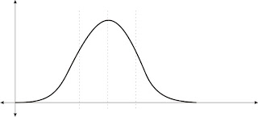
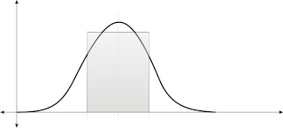

# Sekilas Tentang Kreativitas

dengan hormat,  
Bergas Bimo Branarto - 4:03 AM Rabu, 29 Juli 2009

tarik nafas, buang..  
tarik nafas lagi, buang lagi..  
sekali lagi tarik nafas dalam,  
tahan udara di perut, pindahkan ke diafragma,  
kembali ke perut, pindah lagi ke diafragma,  
kembali ke perut, lalu keluarin perlahan sambil bilang 'hantuuuuu..'

sekarang ambil korek pake tangan kanan,  
pegang seperti mau nyalain korek itu,   
trus tangan kiri buka bungkusan rokok,  
ambil sebatang rokok,  
pijit pijit dulu rokoknya..  

....  
.......  
....  
...........  
........  
....

masih mijit mijit...

....  
........  
...........  
....  
.......  
....

oke, sekarang selipin salah satu ujung rokok itu di bibir  
nyalain korek,  
deketin apinya ke ujung rokok,  
isep kuat kuat rokoknya,  
tahan asepnya di perut, pindahkan ke diafragma,  
kembali ke perut, pindah lagi ke diafragma,  
kembali ke perut, lalu keluarin perlahan sambil bilang 'hantuuuuu..'

----------

kita mulai.

saya punya satu sloki air kencing dan sebatang rokok menyala.  
pertanyaannya: apa yang harus saya lakukan?  
sebelum pertanyaan ini jadi lebih garing, saya langsung jawab aja: saya harus ngetik.

jadi begini ceritanya..

kemaren saya baca2 [blognya si gilang](http://freakanjist.blogspot.com/), trus beberapa jam yang lalu nyempet2in nonton [oddisey-nya anak2 SBM 08](http://www.sbm.itb.ac.id/new_and_noteworthy/Oddisey_2009), dan apa yang saya pikirin sekarang?  
ternyata saya masih terngiang-ngiang sebuah kata yang terdiri dari satu huruf 'k', diikuti huruf 'r', lanjut huruf 'e', then huruf 'a', berikutnya huruf 't', setelah itu huruf 'i', trus huruf 'v', eh abis itu 'i' lagi, udah gitu huruf 't' lagi, kemudian huruf 'a', terakhir huruf 's'.

ya, 'kreativitas'.

ada apa rupanya dengan kreativitas?  
ga ada apa2, dia baik2 saja..  
cuma sedikit bertanya-tanya, dari mana dia datangnya?

ada sebuah kondisi, ente coba tanggapi kondisi itu dengan persepsi dan interpretasi ente biasanya. kalo udah, lalu buat sebuah tanggapan atas kondisi itu dengan persepsi dan interpretasi yang sebaliknya dari yang biasanya ente pikir. pas ente lagi enak2nya mikir, ente liat orang2 di sekitar ente juga kaya yg lagi mikirin tanggapan untuk kondisi serupa.

tanggapan mereka kan bisa macem2 tuh, ente lihat dari ekspresi mereka, trus tebak2 kira2 apa sih yang ada di pikiran mereka. ngasal aja, namanya juga kreatif, mesti imajinatif dong. kalo udah kebayang, berarti kira2 ente udah bisa nebak arah pemikiran orang2 itu. sekarang tugas ente adalah: nebak2 lagi kira2 hal apa yang ga ada di pikiran orang2 lain itu.

di bawah ini ada sebuah kurva. ini adalah kurva distribusi normal.

keterangan:  
sumbu horisontal: nunjukin data  
sumbu vertikal: nunjukin jumlah

lihat bentuknya, gendut di sekitar tengah. kenapa kurva ini namanya kurva distribusi normal? karena kurva ini nunjukin jumlah rata2 dari suatu data. dari hasil penelitian (ini urusannya para peneliti aja lah!) jumlah suatu data dari beberapa kalipengambilan data tuh akan membentuk posisi rata2. posisi rata2 ini kurang lebih ada di tengah (bagian gendut) dari kurva di atas.

di kurva itu saya kasih 3 garis bantu untuk memperjelas mana tengah dan mana data yang kira2 termasuk di rata2 data. biar lebih jelas lagi, nilai2 rata2 data itu bisa kita anggep berada di dalam lingkup kotak dari kurva di bawah ini:

trus apa hubungannya kurva atau kotak ini dengan kreativitas?

kan ente tadi udah nyoba nebak2 pikiran orang2 di sekitar ente tuh, nah masukin kondisi2 pikiran orang2 itu dai grafik. kira2 akan ada beberapa orang yang punya pikiran yang mirip2. makin banyak orang yang ente tebak2 pikirannya, makin bagus juga kurva ini nantinya. dari data tebakan ente itu nanti akan ente dapet pikiran yang kira2 mirip dan dipikirin oleh banyak orang. makin banyak jumlah orang yang mikir itu, berarti pikiran itu posisinya ada di tengah kurva.

jelas pikiran2 itu ga akan sama persis, makanya ente mendingan bikin kategori2 untuk masukin data tebakan pikiran itu. akan ada beberapa kategori yang mirip (ga sama), lihat jumlah orang yang mikirnya ada di kategori2 tersebut, trus taro deh di grafik. sampe bates tertentu (ente sendiri yang nentuin batesnya) dari grafik itu, bikinlah sebuah kotak yang nunjukin jumlah orang yang mikir dengan kategori2 tertentu.

trus apa gunanya kotak itu?

ah ente pasti sering denger lah istilah 'berpikir di luar kotak' atau 'think out of the box'.
kira2 yang dimaksud 'kotak' atau 'box' itu adalah kotak yang anda buat berdasarkan jumlah orang yang mikir dengan kategori pemikiran tertentu.

jadi kesimpulannya: berpikir di luar kotak berarti mikirin hal-hal yang ga dipikirin sama mayoritas orang.

eh seniman2 kan pada kreatif tuh, tapi kayanya mereka jarang (hampir ga pernah) mikirin apa yang ada di pikiran orang lain deh, mereka cuma ngeksplor apa yang ada di pikiran mereka aja. iya ga sih?

wah, referensi ente seniman tua (senior) kali? pernah lihat calon2 seniman kan, mereka berusaha keras untuk mikir hal yang ga dipikirin orang lain. mereka berusaha keras untuk selalu terlihat beda dari yang lain. sampe akhirnya lama kelamaan baru deh kebentuk cara pikir mereka yang beda dari cara mikir mayoritas orang.

yah semuanya juga pasti butuh proses lah, mana ada yang instan. (presiden instan juga kan cuma retorikanya lawan politik sang presiden indomie, ga ada sesuatu yang instan).

jadi, gimana caranya untuk memicu (atau memacu?) kreativitas?

sebagai orang normal, langkah awalnya ya coba dulu aja untuk nganalisa suatu kondisi dengan pikiran ente biasanya. trus pikirin hal yang sebaliknya. selanjutnya tebak2 apa yang ada di pikiran orang lain. lalu mikirlah sebaliknya. gabungin hasil pikiran ente sendiri dengan hasil tebakan pikiran orang lain. biar gampangnya sih bikin aja grafik datanya untuk ngeliat jumlah dari masing2 pemikiran. dan pikirinlah hal lain yang ga dipikirin sama mayoritas orang lain itu.

tiap nemu suatu kondisi, lakukan terus kaya gitu. lama2 akan kebentuk sendiri kok pola pikir kreatif ente..

----

sotoy berat nih si saya  
hehehe  
gapapa lah ya  
lagian, ada satu sloki kencing dan rokok tapi kok harus ngetik.  
jadinya kaya gini deh.

after all, ijinkan saya seruput dulu kencing di sloki saya.  
lalu biarkan saya merokok dengan tenang sambil berimajinasi.