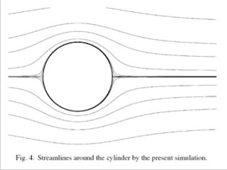

# Berkelana Bersama Udara

dengan hormat,  
Bergas Bimo Branarto - 4:34 AM Sabtu, 01 Agustus 2009

Suatu hari aku duduk di tepian sebuah sungai. Aku duduk menengadah melihat ke atas, melihat langit yang biru agak sidikit kelabu menghitam di beberapa bagiannya. Kekotoran yang tercipta akibat modernisasi yang tidak diimbangi dengan wawasan akan lingkungan. Kutengokkan kepalaku ke kiri, pohon-pohon besar berumur puluhan, bahkan mungkin ratusan tahun, aku tidak tahu pasti soal itu. Tapi aku tahu dengan pasti bahwa adanya pohon dengan daun yang lebat rimbun hijau itu membuatku kembali rileks dari kepenatan kota yang sehari-hari ku temui.

Kutengokkan kepalaku ke kanan, kembali hamparan pepohonan besar menemani pandangan mataku. Ah betapa nyamannya dunia ini, hijau dan teduh. Kuletakkan tangan di sebelah kananku, terasa rumput hijau menyentuh telapak tanganku yang sensitif. Rumput yang tidak terlalu tinggi, tidak terlau pendek, pas sekali terasa nyamannya. Tidak gatal.

Sambil kuhirup sejuknya udara yang mengalir, kurasakan tiap hembusan menerpa sekujur permukaan kulitku yang terbuka. Hebat sekali angin itu, dia tidak hanya menyentuh permukaan kulitku yang berhadapan langsung dengan arah datangnya, tetapi setelah dia menyentuh permukaan tegak lurus itu, dirinya lalu menyelimuti seluruh permukaan yang dia lintasi.

Kembali aku hanyut dalam lamunanku, menerka-nerka, mencoba membayangkan keteraturan seperti apakah alam ini, khususnya mengenai angin yang menyelimuti seluruh permukaan ruang tanpa terkecuali. Terus bergerak lembut menjaga dengan gerakan yang gemulai. Seperti jari lentik seorang ibu yang membelai halus anak bayinya dengan perasaan sayang yang tulus dan tak akan tergantikan dengan bilangan berapa pun, mau pun alat tukar dengan nilai berapa pun.

### Sifat angin

Sekumpulan partikel angin bergerak melaju bersama, dalam satu kesatuan gerak yang berturbulensi. Ketika waktu bergerak secara laminer, hembus angin tidak akan terpengaruh dan tetap teguh pada pendiriannya yang berturbulensi. Karakter. Karakter yang terus dipertahankan sampai akhir hayatnya, jika ada akhir hayat bagi sang angin.

Turbulensi, gerak bergolak tidak teratur menurut KBBI. Benarkah dia tidak teratur? Suatu pusaran jelas memiliki gaya inersial dan jelas pula pusaran fluida ini dipengaruhi adanya kadar kekentalan. 

Hey Osborne Reynold, bilanglah pada kami tentang bilanganmu yang kami bilang sebagai bilangan Reynolds. Kau katakan pada kami melalui wikipedia bahwa bilangan yang kau bilang itu sebagai tingkat turbulensi, dan kau katakan juga pada kami bahwa makin kental suatu fluida yang mengalir maka makin sulit juga fluida tersebut untuk bergolak. Lalu kami simpulkan saja dari yang kau bilang itu bahwa tingkat gejolak merupakan hasil perbandingan antara gaya inersial dengan kekentalan.

Dalam alirannya, aku tidak tahu aliran apa itu sebenarnya. Makin kupikirkan, makinlah aku terhanyut dalam pusarannya. Terus aku mencoba untuk tetap sadar, mulai kulampiaskan akalku yang terbatas untuk membayangkan aliran itu sebagai sekawanan **partikel sejenis yang memiliki massa jenis sama**.

Massa. Bicara tentang massa, tentu berlaku **hukum kekekalan massa** yang kita bicarakan. Kestabilan kuantitas massa ini tentu akan mempengaruhi sifat tabrakan antar sesama mereka. **Ada jarak tertentu yang dapat mereka lalui sebelum akhirnya mereka bertabrakan**. 

Haruskah mereka bertabrakan? Ah biarkan saja lah, toh memang itulah yang terjadi pada mereka selama ini. Lalu dimana kekalnya massa-massa itu? Yah, **mereka bertabrakan, tapi tabrakan itu ga menghilangkan massa masing-masing**. Mereka bukan partikel pembunuh!

Kita tidak melihat satu partikel saja, ada banyak partikel bertebaran dimana-mana. Mari kita bayangin, kita tiba-tiba bisa membuat toples dan kita taro aja di sembarang tempat di udara, trus kita tutup toples itu dengan cepet. 

Partikel-partikel yang kejebak di dalem toples punya kerapatan tertentu. Toples ini sangat rapat, ga ada partikel yang bisa keluar atau masuk dari dalam toples itu. Trus kita bayangin toples itu menciut, anggeplah karena ada tekanan dari luar.

Apa yang terjadi sama partikel-partikel di dalemnya? Mereka makin merapat satu sama lain. Kerapatan awal mereka berubah. **Mereka kumpulan partikel yang termampatkan**. Bicara tentang ketermampatan berarti juga bicara tentang kekentalan. Dalam aliran pergerakan mereka, sesama mereka membentuk suatu kekentalan yang kerapatannya dapat berubah, tergantung dari ada atau tidaknya tekanan dan pergeseran yang terjadi di antara mereka.

Bicara tentang pergerakan, pasti ada kecepatan yang kita bicarakan. Bicara tentang massa dengan kecepatan, berarti juga bicara tentang momentum. Jika massa keseluruhan adalah kekal, berarti **momentum secara keseluruhan juga akan kekal**. Memang, satu partikel di dalamnya bisa aja kehilangan momentumnya, tapi dari kumpulan itu, jika ada satu yang kehilangan momentumnya maka ada satu juga yang memperoleh momentum, jadi keseluruhannya punya momentum yang tetap.

Oke, anggaplah emang begitu adanya. Trus apa hubungan antara momentum yang kekal dengan kekentalan dan ketermampatan?

Momentum yang kekal nunjukin bahwa sekumpulan partikel itu terus bergerak, terus ngalir. Dalam alirannya mereka akan nemuin banyak penghalang. Anggeplah penghalangnya yang kita bahas di sini adalah permukaan kulit kita. Dari sekian banyak partikel yang ngalir, **cuma yang paling deket dan nyentuh permukaan kulit kita lah yang akan ngalamin gesekan**.

Ada gesekan berarti ada perlambatan pergerakan. Partikel selalu bergerak, jadi partikel yang nggesek kulit kita ga akan terus diam karena gesekan, mereka akan mantul dan nabrak lagi partikel di sekitarnya dan ada lagi partikel yang akan ngisi tempat partikel awal tadi. **Karena pengaruh kekentalan, kondisi itu akan membuat adanya turbulensi** antar partikel di sekitar permukaan kulit kita.

Turbulensi itu akan berlalu sampai permukaan kulit kita udah terlewati, mereka akan balik lagi ke “track lurus” aliran mereka. Kenapa bisa lurus lagi? Karena gesekan udah hilang, dan mereka saling tabrakan lagi untuk nyari keseimbangan aliran mereka. Begitu terus perjalanan mereka tiap nemuin penghalang.

Yah, kita semua tampaknya perlu belajar pada partikel angin. Berjalan bersama dalam satu kumpulan, membentuk aliran. Di dalamnya tentu banyak senggolan atau benturan antar mereka, tapi tidak mengurangi jumlah mereka. Benturan-benturan itu dijadikan acuan untuk membentuk aliran mereka bersama. Bukan masalah menang-kalah, tapi mereka semua pada akhirnya menang dan menentukan arah aliran mereka bersama-sama.

### Referensi
- [rothman & zaleski. lattice gas cellular automata.](http://books.google.co.id/books?id=xa5UZvn20h4C&dq=lattice+gas+cellular+automata+rothman&printsec=frontcover&source=bn&hl=id&ei=nmVzSrLwK4v26gOthciTCw&sa=X&oi=book_result&ct=result&resnum=4#v=onepage&q=&f=false )
- [wendt, john. computational fluid dynamics.](http://books.google.co.id/books?id=IIUkqI-HNbQC&dq=computational+fluid+dynamics+john+wendt&printsec=frontcover&source=bl&ots=PD3fLSfbgB&sig=4TPS9u0XH_vaOYpkrhVh7SlyeRQ&hl=id&ei=PGZzSr6zPKX26gPFk6GpCw&sa=X&oi=book_result&ct=result&resnum=1#v=onepage&q=&f=false)
- [hasslacher, brosl. discrete fluids.](http://www.fas.org/sgp/othergov/doe/lanl/pubs/00285743.pdf)
- [branarto, bergas b. dinamika partikel pada lattice gas cellular automata.](http://www.scribd.com/doc/16667328/Dinamika-Partikel-Pada-Lattice-Gas-Cellular-Automata)