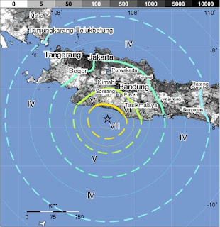
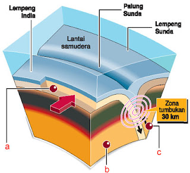
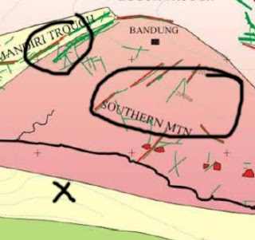

# Gempa Tasik

dengan hormat,  
Bergas Bimo Branarto - 2:25 AM Kamis, 03 September 2009

[Gempa tasikmalaya (2 september 2009)](http://earthquake.usgs.gov/eqcenter/pager/events/us/2009lbat/index.html) kejadian karena ketemunya lempeng sunda dengan lempeng india di 142 km dari tasik di kedalaman 30 km di bawah permukaan.

menurut [data dari usgs](http://earthquake.usgs.gov/eqcenter/recenteqsww/Quakes/us2009lbat.php) di titik episentrum kecatet amplitudo gempa 7.0 skala richter. [Efek terparah](http://www.antaranews.com/berita/1251911004/gubernur-korban-tewas-akibat-gempa-44-orang) ada di daerah garut, tasik, cianjur, ciwidey, sukabumi; yaitu ngancurin rumah dan mengakibatkan adanya korban jiwa. Dari sini jadi penasaran: Apa hubungan daerah2 itu sama lempeng sunda atau lempeng india?

Pulau jawa ada di antara 2 lempeng yaitu lempeng sunda dan lempeng india. Lempeng india bergerak ke utara dengan [kecepatan 6.5cm per taun](http://www.ahmadheryawan.com/opini-media/ekonomi-bisnis/4125-bumi-antara-bencana-dan-kemakmuran.pdf). lempeng sunda (lempeng asia tenggara) berada di utaranya. dari sini bisa disimpulin cepat atau lambat pasti akan terjadi gempa di sekitar pulau jawa.

[Sesar](http://geodesy.gd.itb.ac.id/?page_id=82) merupakan batas antar lempeng. Berarti pergerakan lempeng akan berakibat pergeseran pada sesar. Gempa bumi yang terjadi di daerah sesar dapat melahirkan sejumlah bencana, misalnya korban jiwa, kerusakan pada berbagai struktur bangunan, longsoran, dan lain-lain.

Daerah yang memiliki [sesar aktif](http://www.gatra.com/2006-06-07/artikel.php?id=95114) justru di Jawa Barat. Setidaknya ada sembilan sesar, antara lain Garut Selatan dan Kuningan. Namun hanya dua sesar yang sudah bernama, yakni Sesar Cimandiri di sisi selatan Sukabumi dan Sesar Baribis di sekitar Majalengka. Patahan aktif ini tidak jauh dari permukiman. ''Karena itu, sangat potensial mengundang bencana,'' kata Surono.

Sukabumi selatan berada di lingkup [sesar cimandiri](http://geodesy.gd.itb.ac.id/?page_id=83). kelurusan Sesar Cimandiri dari Pelabuhan Ratu mengikuti aliran sungai Cimandiri dan menerus ke timur laut sampai ke Lembang. sesar Cimandiri melewati beberapa daerah yang cukup sarat penduduk, seperti Pelabuhan ratu, Sukabumi, Cianjur, dan Padalarang. Dari sini kita coba bayangin garis sesar cimandiri ini manjang secara horisontal, berarti sejarah pergeserannya adalah utara-selatan.

[Sesar Lembang](http://geodesy.gd.itb.ac.id/?page_id=82) berupa gawir (tebing) sesar dengan dinding gawir menghadap kearah utara. Sesar Lembang dari timur ke barat (horisontal), Maribaya, G. Pulusari) sampai Cisarua dan utara Padalarang. Bentuk horisontal menunjukkan sejarah pergeserannya utara-selatan.

Ada juga beberapa [sesar di jawa barat yang belum diberi nama](http://www.gatra.com/2006-07-31/artikel.php?id=96662), di antaranya sesar yang ada di Kabupaten Garut dan wilayah Bandung bagian selatan (ciwidey termasuk wilayah bandung bagian selatan) atau kawasan Patuha serta sesar di Tasikmalaya. "Sesar atau patahan di darat itu semuanya masih aktif, bahkan sesar Lembang beraktivitas terakhir pada 11 Juli 2003," ujar Hendri. Bentuknya yang cenderung horisontal juga menunjukkan sejarah pergeseran utara-selatan.

Dari [data korban meninggal](http://www.antaranews.com/berita/1251911004/gubernur-korban-tewas-akibat-gempa-44-orang) terbanyak yang saya peroleh terakhir, saya coba simpulin pergeseran lempeng india – lempeng sunda ini ‘mengganggu’ sesar cimandiri, sesar tasik dan sesar garut (+bandung selatan). Wilayah sesar lembang (bandung utara dan barat, bogor) bisa dibilang ‘hanya’ terkena imbas dari reaksi sesar-sesar di sekelilingnya.

[Yang digariskan warna merah itu patahan hingga ke batuan dasar, sedangkan yg warna hijau patahan yg terlihat dipermukaan saat ini](http://karangsambung.lipi.go.id/?p=24). yang saya lingkari adalah perkiraan daerah dengan kerusakan terparah dan tanda X adalah perkiraan episentrum.

Bandung kan merupakan lembah, dan keliatan dari gambar bahwa bandung dikitari sama sesar-sesar yang ‘terganggu’ dengan pergerakan lempeng india-sunda. Kalo banyak korban berarti ada gempa bumi yang cukup besar, berarti ada pergeseran yang cukup berarti.

Kira2 gimana pengaruh pergeseran itu ke topografi daerah bandung ya? Mengingat di bagian utara dan selatan bandung terdapat kawah, yang berarti di bawah lapisan bandung terdiri dari cairan. Jika lempeng bergeser menjauh, maka volume ‘wadah’ cairan jadi lebih luas, berarti permukaan cairan turun, dan berarti juga permukaan bandung turun. 

Bener ngga sih?