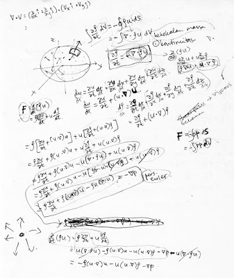

# Coretan dan Dongeng

dengan hormat,  
Bergas Bimo Branarto - 8:29 PM Minggu, 04 Oktober 2009

Sejak beberapa hari terakhir ini saya asik bercengkrama dengan kertas dan bolpen, sesekali ketemu papan kunci dan neken-neken beberapa huruf yang tergambar di mukanya. Sesekali juga membelai tikus yang berkabel. Sesekali juga ngelongok ke mata anehnya [temennya si kawan hitam](../../2009/04/kawan-hitam-dan-temannya.md).

Sesekali juga saya keluar dari gua berlantai mblendung yang ga juga diberes-beresin sama si empunya kuasa. tersengat panas matahari bandung di waktu siang, ngedenger suara canda bocah-bocah berseliweran make seragam, bersendawa bersama kawan-kawan biru yang mulai menampakkan kedewasaan dalam pikiran dan habitatnya masing-masing, duduk di sebuah sandaran menonton parodi yang diselenggarakan oleh sebuah institusi ternama sambil berkomentar dan/atau tidur di tengahnya.

Atau bahkan keluar saat matahari udah tidur lagi, sekedar nyari rokok dan/atau kopi sambil lewat berkomentar ke para tetangga yang ngariung di depan sebuah rumah bertingkat, menggelar meja di belakang sebuah mobil dengan modus bermain gaple padahal menanti pulangnya seorang anak kos berkulit putih berwajah manis berkelakuan bebas. Dan kadang ikut duduk bersama mereka sekedar melempar gosip tentang ini itu sambil ngisep beberapa batang rokok sebelom akhirnya balik ke sebuah gua yang dengan seenaknya saya sebut sebagai studio.

Kembali mengambil bolpen, meracau di atas kertas, sambil sesekali neken-neken papan kunci dan ngelongok ke mata anehnya temennya si kawan hitam.

Saya liat-liat lagi apa yang udah kecoret di berlembar-lembar kertas. Sebentar saya bengong ngliatnya sambil mikir ‘ni apaan sih?’ dan setelah sekian teguk kopi panas dan sekian isep rokok kretek baru deh pertanyaan tadi kejawab ‘owh, ini kan yang tadi..’. dan berusaha nyoret sesuatu di kertas sambil mikirin jawaban pertanyaan barusan yang dirasa cukup menjawab padahal ngawang-ngawang.

Buntut dari jawaban pertanyaan itu adalah sebuah ide bernama ‘ulang lagi aja ah..’ dan saya mulai nggambar trus diikuti dengan keterangan-keterangannya (mungkin kata ‘kegelapan’ agak lebih cocok utk gantiin kata ‘keterangan’). Tapi ga ngaruh lah semua pikiran-pikiran kaya gitu, sejauh ini mereka ga ngubah arah (baik terhadap waktu maupun komponen ruang) pikiran melenceng dari aliran utama pikiran saya.

Dan inilah dia, satu dari sekian lembar, saya cuplik yang dapat terbaca dengan paling jelas.

Tenang, harap kita semua **tetap berpikir positif**.

Dengan pikiran positif gambar di atas bisa berubah jadi sebuah cerita menarik tentang sekumpulan mahluk di dalem sebuah ruang tertentu. Anda ga percaya? Sama, saya juga.

Gini aja, sekarang silakan anda nyamankan posisi duduk anda, senyaman mungkin, nyandar kalo perlu atau naikin kaki ke meja atau duduk a la warteg, bebaskeun weh meh santai. Kalo anda akan ngerasa nyaman setelah nge-close halaman ini, silakan di-close. Gimana nyamannya aja lah.

## Mahluk Seperti Ikan dan Sang Raksasa

Jadi begini, pada suatu ketika di malam yang dingin dan gelap sepi, benakku melayang pada sekumpulan mahluk seperti ikan; bersirip, bernafas dengan insang, tapi dia punya taring yang besar dan kuat, kita sebut saja dia ‘mahluk-seperti-ikan’. Mahluk ini berhabitat di laut terdalam, demikian habitat mereka sehingga mereka dikaruniai kemampuan penglihatan yang sangat buruk, atau kita sebut saja mereka buta. Di samping kekurangan dalam hal penglihatan, secara alamiah mereka diberi anugerah umur yang sangat panjang sampai waktu tak terhingga, kita sebut aja mereka mahluk abadi.

Mereka masing-masing berenang kesana kemari, **bergerak bebas ke segala arah**, tanpa terbelenggu oleh suatu apa pun. Dalam kondisi tanpa gangguan dari mahluk lain, gerakan mereka adalah murni milik kehendak mereka sendiri.

Tanpa mereka sadari, sesosok raksasa mengintai mereka dari atas kapalnya yang hampir tenggelam. Sang raksasa telah bersiap dengan tombak di tangan kanan dan jaring di tangan kirinya. “lumayan lah buat cemilan!”, demikian pikir sang raksasa.

Dengan gerak perlahan tapi pasti, sang raksasa melemparkan jaringnya yang langsung terbenam di laut tersebut. Gerakan mulus si jaring dalam ayunannya mengikuti arus membuat mahluk-seperti-ikan tidak menyadari bahaya yang akan segera menyergap mereka.

Tak berapa lama jaring tersebut telah menyelimuti sebagian mahluk-seperti-ikan. Dan dengan satu hentakan cepat tangan sang raksasa membawa jaring tersebut membungkus sebagian mahluk yang masih belum juga menyadari bahwa diri mereka berada di dalam **ruang baru yang tercuplik dari lautan luas**.

Mahluk-seperti-ikan yang berada di bagian yang nempel dengan jaring lambat laun mulai nyadar bahwa mereka kini dibatasi oleh sesuatu yang halus dan berbentuk jaring, dia segera memberitau kawan-kawan lainnya yang langsung bergerak masing-masing menandakan kepanikan mereka. Insting untuk bertahan hidup membuat beberapa dari mereka secara inisiatif segera mengerumuni satu celah jaring dan berusaha memperbesar celah itu agar mereka dapat keluar.

Dan berhasil! Sebuah celah telah terbentuk di bagian itu dan beberapa dari mereka melaju keluar dari kungkungan jaring. Celah itu demikian pasnya dengan ukuran badan mereka jadi untuk ngelewatinnya **mereka harus bergerak tegak lurus dengan lebar celah**. Sayangnya, mereka lupa memberitau kawan-kawan lainnya bahwa ada lubang yang dapat digunakan untuk keluar.

Sekarang jumlah calon makanan raksasa itu berkurang sebagian. Jumlah pengurangan mereka sama dengan jumlah mahluk-seperti-ikan yang bergerak dengan kecepatan tertentu yang ngelewatin satu-satunya celah itu. Karena mereka mahluk abadi, maka jumlah mereka di lautan itu tidak berkurang satu pun.

Sang raksasa dengan cepat dapat nyimpulin bahwa **kekekalan jumlah mereka dinyatakan sebagai perbandingan antara jumlah pengurangan mereka di dalam jaring dengan jumlah mereka yang keluar dengan kecepatan tertentu yang ngelewatin celah**. Dan dengan anggapan seperti itu, sang raksasa merasa tidak perlu khawatir kalo saat ini dia cuma dapet sedikit mahluk-seperti-ikan, toh dia bisa ngambil sisanya di kemudian waktu.

Melihat reaksi mahluk-seperti-ikan yang bergerak liar ketika dia tarik jaringnya tadi, dia mendiamkan jaringnya sesaat dengan harapan mahluk-seperti-ikan lupa bahwa mereka sedang dijaring. Dan memang ternyata mahluk-seperti-ikan terlihat tenang seperti sediakala.

Sang raksasa tiba-tiba menghentak kembali jaring dengan kuat sehingga sekeliling jaring menekan ke dalam. Seketika itu juga **tekanan yang diberikan seluas permukaan jaring** membuat mahluk-seperti-ikan di dalamnya kembali menjadi panik dan kembali bergerak membabi buta. Mereka tiba-tiba **mengubah kecepatan gerak mereka**, **mengubah arah gerak mereka**, dan dalam perubahan itu ada yang dengan beruntungnya **berhasil kabur melalui celah**. Kembali jumlah mereka berkurang, menyisakan para mahluk-seperti-ikan yang terperangkap dalam kekalutan.

Melihat reaksi mahluk-seperti-ikan yang seperti itu, sang raksasa kembali berpikir “emangnya sekeras apa sih gw nariknya tadi, kok segitunya amat reaksinya?”.

.. bersambung