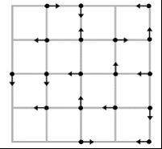
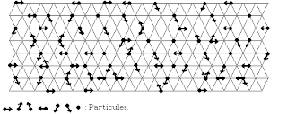

# Lattice Gas Cellular Automata

dengan hormat,  
Bergas Bimo Branarto - 2:50 PM Senin, 12 Oktober 2009

Gerakan pada fluida yang terlihat pada eksperimen menampilkan dua sifat dalam satu aliran yang bisa dijelaskan secara teoritis masing-masing menggunakan persamaan diferensial eliptik (untuk bagian tengah fluida) dan persamaan diferensial hiperbolik (pada bagian pinggir fluida). Persamaan perantara yang menjelaskan perubahan sifat itu tidak dapat ditemukan sehingga penjelasan mengenai fluida tidak dapat dilakukan hanya dengan pendekatan eksperimen atau teoritis saja.

## Cellular Automata

Pada akhir 1940-an, Ulam dan von Neumann mengusulkan bahwa [program komputer dapat digunakan untuk mensimulasikan kehidupan](http://www.wolframscience.com/reference/notes/876b). Ide awalnya adalah tiap entitas merupakan sebuah sistem yang berada pada sebuah titik kisi dan saling terhubung dengan tetangganya. Keadaan pada suatu time step akan menentukan kondisi keterhubungan antar mereka pada time step berikutnya.

Mereka menyatakan bahwa pada kondisi tertentu, tingkah laku kolektif seluruh sistem menjadi sedemikian kompleks sehingga mengimitasi aspek dari sistem biologis, lebih spesifik lagi, yaitu sistem reproduksi. Sistem saling-terhubungan antara sistem terbatas ini akhirnya dikenal dengan nama _[Cellular Automata](http://books.google.co.id/books?id=W5jH2vewgAoC&pg=PA3&lpg=PA3&dq=cellular+automata+ulam+-+von+neumann&source=bl&ots=tLR6cwFLB8&sig=wV6aIL-vS0AMW_gHu1admQqv1sY&hl=en&ei=2N7SSvvTLsWNkAXy2Oj_Aw&sa=X&oi=book_result&ct=result#v=onepage&q=cellular%20automata%20ulam%20-%20von%20neumann&f=false)_.

Sistem _Cellular Automata_ merupakan metode penggambaran berbeda mengenai fenomena fisika, alih-alih menggunakan solusi numerik dari persamaan diferensial dalam menyatakan gerak, sistem ini menggunakan [komputer untuk mensimulasikan aspek-aspek fisis](http://en.wikipedia.org/wiki/Computational_fluid_dynamics) yang dijadikan acuan oleh persamaan-persamaan tersebut. Pada pembahasan mengenai dinamika fluida, sistem analisa numerik secara teoritis tidak mampu menjelaskan beberapa perubahan sifat yang terjadi dalam aliran.

## Lattice Gas Automata

Pada 1970-an Hardy, Pazzis dan Pomeau membuat sebuah model untuk menggambarkan pergerakan fluida. Model yang disebut Lattice-Gas ini menggunakan konsep atomik dalam menggambarkan pergerakan makro pada fluida. Mereka menganalogikan adanya partikel yang terletak pada sebuah kisi fiktif pada fluida dan bergerak dengan memegang prinsip kekekalan massa dan kekekalan momentum. Partikel-partikel ini diandaikan memiliki massa yang sama, dengan kecepatan yang sama. Model ini, disebut dengan [Lattice Gas Automata model HPP](http://new.math.uiuc.edu/im2008/dakkak/implementation/implementation.html), menggunakan kisi segi empat dengan empat arah kecepatan.

Partikel pada model fluida ini memiliki jarak konstan pada kisi, bergantung pada _[mean free path](http://en.wikipedia.org/wiki/Mean_free_path)_ partikel. Kondisi awal ditentukan dengan memberikan kecepatan partikel pada kisi. Waktu dibuat diskrit dalam satuan time-step. Pada tiap time-step partikel akan berpindah dan terhambur. Kecepatan partikel dinyatakan sebagai vektor yang menunjukkan kemana partikel tersebut akan bergerak pada tiap time-step berikutnya. Jika terjadi tumbukan, partikel yang bertumbukan akan mengalami perubahan arah kecepatan dan berlaku sifat kekekalan momentum (jumlah momentum pada saat t sama dengan jumlah momentum pada saat t+1).

Pada penerapannya fluida yang dimodelkan bersifat anisotropik, bertentangan dengan sifat fluida asli yang isotropik. Sifat isotropik berarti partikel memiliki keseragaman sifat fisis, seperti elastisitas dan konduktivitas pada semua arah, serta memiliki kemungkinan yang sama untuk bergerak ke setiap arah. Pada model ini tensor momentum invarian pada rotasi π/2.

Kemudian pada tahun 1986 model ini disempurnakan oleh Frisch, Hasslacher, dan Pomeau dengan sebuah model berbentuk segienam dengan enam atau tujuh arah gerak kecepatan. Model ini diperoleh dari kritik terhadap model HPP, dan menurut penghitungan matematis, ternyata sifat isotropis akan diperoleh jika tensor momentum invarian pada rotasi π/3 . Sifat ini diperoleh pada bentuk kisi segitiga sama sisi.

pada model FHP, dinamika partikel secara umum dinyatakan dengan persamaan
> ni(x+ci,t+1) = ni(x,t) + Δi[n(x,t)]

t bernilai integer dan menyatakan satuan tiap time-step.  
ni merupakan variabel Boolean yang menyatakan ada (ni=1) atau tidaknya (ni=0) partikel.  
i menyatakan arah gerak partikel, dalam hal ini kita menggunakan 6 arah gerak sehingga i=1,2,3,..,6.  
ci menunjukkan arah gerak dan x menyatakan posisi awal.  
Δi merupakan variable Boolean yang menyatakan ada (Δi=1) atau tidak (Δi=0) partikel yang mengalami tumbukan pada arah i.

ni(x+ci,t+1) menyatakan kondisi partikel pada titik kisi x dengan kecepatan tertentu pada time-step t+1, ni(x,t) menyatakan kondisi partikel pada saat t (kondisi awal), Δi[n(x,t)] menunjukkan ada atau tidaknya tumbukan yang terjadi pada partikel di kisi pada arah tertentu.

### References
- [History_of_Cellular_Automata](http://wiki.uelceca.net/20072008/files/History_of_Cellular_Automata.pdf)
- [HPP Latice Gas](http://books.google.co.id/books?id=jQrpXRzhyFgC&pg=PA34&lpg=PA34&dq=HPP+lattice+gas&source=bl&ots=6GwPh8Uect&sig=dQ3RKDeTe7dW0r_X5_fW22VpxIc&hl=en&ei=DuTSSrXxG86OkQXsrfj8Aw&sa=X&oi=book_result&ct=result&resnum=7&ved=0CCoQ6AEwBg#v=onepage&q=HPP%20lattice%20gas&f=false)