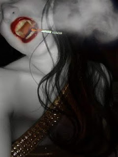

# Berpikirlah Selangkah ke Depan

dengan hormat,  
Bergas Bimo Branarto - 1:52 AM Selasa, 06 April 2010

"berpikirlah selangkah ke depan.", telinga Nya menangkap getaran gelombang suara menjalar dari pita suara ayahnya. bukan sekedar rambatan getaran, tetapi makna dari getaran itu pun disambut dengan mengalirnya awan pikiran Nya, dari potensial yang rendah ke potensial yang tinggi. sekumpulan kata dalam satu kalimat ayahnya itu telah memotivasi dan memberikan acuan bagi alur pemikiran Nya sejak dia masih kecil sampe sekarang (udah agak gedean dikit).

berpikirlah selangkah ke depan. dengan demikian ada delta jarak, dengan gaya yang dihasilkan dari proses berpikir berarti kita akan dapat nilai suatu usaha ( W = F x S ; W = usaha, F = gaya, S = jarak). berpikirlah selangkah ke depan. demikian suara-suara di kepala Nya terus berseru.

"ah, capek juga gw ngomong sama diri gw sendiri!", seru Nya pada suatu sore yang seperti sore-sore biasa di kehidupannya. akhirnya beliau memutuskan untuk nonton film aja.

-------

terputarlah sebuah film tentang mahluk penghisap darah, berbentuk mirip manusia tapi taringnya panjang. daybreakers. mahluk itu akan kebakar kalo kena sinar matahari. mahluk itu udah jadi penguasa bumi, dimana manusia jadi 'peliharaan' untuk diambilin darahnya oleh perusahaan produsen darah manusia. 

yah ni film lumayan juga lah buat nambahin referensi imajinasi kehidupan vampir di dunia berteknologi maju. vampir udah jadi penguasa industri dan manusia cuma jadi sumber daya untuk diperas sampe akhirnya persediaan darah manusia habis, dan tiba2 muncul suatu 'penawar' untuk ngembaliin vampir jadi manusia lagi. entah deh persisnya kaya gimana, Nya kurang nangkep maksud ceritanya.

selama jalannya film itu, pikiran Nya terpaku sama suatu adegan di film itu, dimana ada **vampir lagi ngerokok**. gayanya cool banget lah, cem iklan rokok. mata Nya ga kedip ngeliat ke arah layar tivi sambil pikirannya lari kemana-mana.

keterangan: ilustrasinya sama sekali ga mirip sama adegan di filmnya.  
ini nyari ilustrasi yang rada seksi aja.

"ngapain vampir ngerokok? kan paru-parunya udah mati, kok bisa narik nafas?".

"vampir ga harus bernafas, tapi dia bisa bernafas.", celetuk salah satu temennya Nya.

"biarin aja sih, paru-paru lu juga bentar lagi mati tapi lu masih ngerokok aja. urusan masing-masing lah.", komentar temennya Nya yang lain lagi.

-------

kalo dia bisa bernafas berarti oksigennya ditarik sama darah sirkulasi, berarti jantungnya juga masih hidup. atau kemungkinan lain yang narik oksigen tuh darah yang dia dapet dari korbannya. yang manapun asumsi yang dipake, berarti tetep harus ada parameter kapasitas maksimum dan minimum jumlah yang diperluin sama vampir (dengan perbandingan manusia) untuk ngolah oksigen untuk kebutuhan mekanisme biologis (atau tanatologis?) badannya.

gimana rasio penarikan volume oksigen dengan volume darah yang dimilikin si vampir?
pas ngisi darah (masih bersih) berarti ada sekian volume oksigen yang bisa ditarik sama darah itu, tapi lama kelamaan (seiring pengotoran darah) pasti ada pengurangan kapasitas oksigen yang bisa ditarik oleh darah.

berapa lama waktu yang diperluin sampe darah itu kotor lagi dan ga bisa narik oksigen? seberapa lama oksigen yang sempet ditarik oleh darah itu bisa bertahan di tubuh vampir? berapa lama waktu maksimal vampir bisa 'puasa' sampai sesaat sebelum dia keabisan oksigen?

demikian sebagian percakapan di dalam kepalaNya.

"hmm sebelom lanjut kemana-mana mending disepakatin dulu aja: jantung dan paru-paru vampir udah ga berfungsi.", lanjut Nya kepada temen-temennya. "kenapa asumsinya kaya gitu?", penasaran nih salah satu temennya Nya.

karena kalo jantungnya masih berfungsi, berarti dia masih mompa darah, berarti logikanya dia ga butuh darah lagi dari luar dan dari film-film sih katanya vampir ga punya denyut nadi dan/atau vena (berarti jantung ga mompa). selain itu paru-paru vampir akan berfungsi kalo ada sirkulasi darah yang narik oksigen (padahal ga mungkin ada sirkulasi darah karena jantungnya ga mompa darah).

tapi kenapa ya vampir mati beneran kalo jantungnya ditusuk? (ini juga yg jadi blunder di film daybreaker, dimana ada adegan vampir dipasangin detektor pulsa jantung, dan si vampir itu ga kedeteksi detak jantungnya.)

terus Nya inget lagi sama celetukan salah satu temennya tadi, bahwa vampir ga harus bernafas walaupun dia bisa bernafas. karena bernafas butuh paru-paru yang aktif berarti komentar temennya Nya ini bisa kita anggep gugur. kesimpulan tambahan: vampir ga butuh oksigen untuk bertahan 'hidup'.

trus buat apa dia ngisep darah??

-------

bentaaarrrrr, coba kita flashback dulu. berpikir selangkah ke depan - vampir ngerokok - mekanisme biologis (atau [tanatologis](http://id.wikipedia.org/wiki/Tanatologi?) vampir.

apa hubungannya 'berpikir selangkah ke depan' sama mekanisme biologis (atau tanatologis?) vampir? lagi pula ini sih bukan mikir ke depan, ini malah mikir ke belakang (lewat pertanyaan implisit 'kenapa vampir bisa ngerokok?'). kalo mikir ke depan tuh contoh pertanyaannya begini: 'kaya gimana rokok yang akan laku untuk dikonsumsi vampir?' atau 'kalo darah abis, produk apa yang akan dikonsumsi sama vampir untuk menuhin kebutuhan 'hidup'nya?'.

"ntar aja lah mikirin sambungannya, siapa tau tiba2 nyambung di ujung cerita nanti..", pikir Nya kemudian, balik dulu ke pertanyaan untuk apa vampir ngisep darah.

kalo menurut [suatu blog](http://wiralodra.com/2009/12/sejarah-vampir/) (referensinya bebas dong, toh kalo mau diusut2 lagi referensi paling jitunya ada di subyektivitasnya bram stoker - jadi suka suka aja deh mau pake subyektivitasnya siapa) sih ciri-ciri vampir tuh mirip sama penderita penyakit [Porphyria](http://surgaku.com/lifestyle/kesehatan/penyakit-porphyria-the-vampire-disease-gak-boleh-keluar-siang.html), yaitu ada gangguan di jalur pembentukan [heme](http://en.wikipedia.org/wiki/Heme), salah satu komponennya [hemoglobin](http://id.wikipedia.org/wiki/Hemoglobin).

hemoglobin ada di dalem sel darah merah. gangguan hemoglobin berarti ada gangguan dengan sel darah merah. gangguan (kekurangan) sel darah merah tuh berarti anemia. efek lain dari porphyria ini tuh kulit jadi sensitif sama matahari.

nah mungkin vampir ngisep darah untuk ngambilin sel darah merah, untuk nambahin kebutuhan hemoglobinnya (tapi untuk apa dia butuh hemoglobin? oksigen aja ga butuh.). dan lagi ternyata dia udah ngambilin hemoglobin manusia tetep aja kulitnya ga bisa tahan sama radiasi ultraviolet dari matahari.

jadi tetep aja pertanyaannya ga berubah, "untuk apa vampir ngisep darah manusia?". okelah, mungkin emang vampir tuh butuh oksigen walaupun dalam jumlah sangat sedikit (saking sedikitnya sampe paru-paru cuma butuh kerja dikiiiiiit banget (sampe dikirain mati) dan jantung ga perlu berdetak sedemikian rupa sampe2 ga bisa kedeteksi di detektor). berarti dia tetep butuh hemoglobin biarpun dalam jumlah kecil. berarti poinnya adalah dia butuh pasokan heme utk mbenerin hemoglobinnya.

-------

nah setelah mikir banyak langkah ke belakang, mungkin Nya udah bisa mulai untuk mikir selangkah ke depan. kan vampir butuhnya heme, berarti di produk apa pun yang akan dikonsumsi sama vampir harus mengandung heme. mungkin bisa injeksi heme lewat rokok, atau tetep cara tradisional pake darah, atau cara lain lah.

suka-suka aja lah, bosen gw mbahas ginian. si Nya jg udah ilang ga tau kemana nih, ga bertanggung jawab!!

tapi biarin lah, yang penting sekarang Nya udah selangkah lebih maju dari yang lain, dia udah lebih siap jadi entrepreneur untuk suatu saat nanti kalo vampir mulai nguasain kehidupan di bumi dan darah manusia mulai langka.