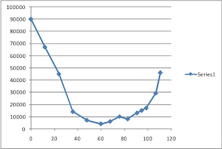
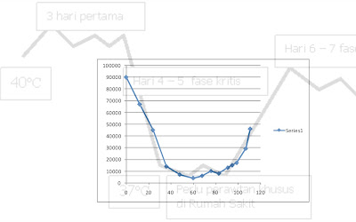

# Beberapa Pikiran Hari Ini

dengan hormat,  
Bergas Bimo Branarto - 8:11 PM Sabtu, 15 Mei 2010

si bokap debede. ini grafik yang nunjukin jumlah trombosit dari cek darah (update terakhir hari keenam, jam14.00). kira2 dimulai pas hari senin dengan jumlah trombosit kalo ga salah 90-an ribu. ini dia grafiknya:

dan kira2 inilah yang gw harepin untuk terjadi:

grafik 1 dan grafik 2 gw tumpuk untuk ngecek pola dan bisa jadi nilai ekspektasi. bagian belakang dari grafik 1, ada penurunan lagi, kalo ga perlu2 amat ga usah diturunin lagi lah. semoga cepet sembuh bok, eh kap. (kalo 'bok' kayanya centil amat ya)

keep up the hope, met berjuang kap.

---

tadi sempet nonton **final piala uber**, cina vs korea. seru gila! 2 pertandingan awal gw ga nonton. nontonnya pas pertandingan ke-3 dan ke-4. yang ke-3 tuh single (lupa siapa yang maen) dimenangin sama pemain cina. yang ke-4 tuh double, dimenangin sama pasangan korea. hasil akhir korea menang 3-1.

dari yang gw tonton, yang paling seru menurut gw pas pertandingan ke-4. yang gw liat, secara umum kedua pasangan pemain punya skill dan power yang setara. kenaikan skor kejar-kejaran terus dan sering kali untuk nambah skor mesti ngelewatin rally panjang. bener-bener di sini stamina diadu banget. saling ngumpan, saling smash, saling netting, saling berusaha mengarahkan dan mengendalikan kecepatan permainan, jelas butuh stamina dan konsentrasi sangat tinggi sepanjang pertandingan.

kerjasama tim jelas diuji. permainan sangat alot, shuttlecock mondar-mandir terus depan-belakang-kanan-kiri. kecermatan dalam mencari posisi dan berkoordinasi dengan kawan juga jadi salah satu hal yang diuji. ini berlaku bagi kedua tim. bagaimana 'membagi wilayah' agar ga berebut mukul, menentukan momen dan arah serangan, dan tetap siap untuk menangkis serangan balasan dari musuh.

gw mulai tertarik ngamatin sejak gw sadar ada suatu scene di pertandingan (lupa set ke berapa) dimana pasangan cina berdiri bersebelahan (penjagaan kanan-kiri) dan pasangan korea bersepakat untuk menembakkan shuttlecock ke tengah antara cina kanan dan cina kiri secara bertubi-tubi. dan saat itu gw liat pasangan cina cukup kelabakan dalam 'membagi wilayah' mukul dan itulah yang diserang sama pasangan korea. dari sini gw baru ngamatin adu strategi antara kedua pasangan.

setelah pasangan korea menambah skor kalo ga salah 2 poin, pasangan cina secara mendadak ngubah strategi pertahanan mereka setelah salah satu pemain korea ngasih bola tanggung (mungkin kecapean, itu abis rally agak panjang) dan cina kanan langsung lompat ke tengah depan net sambil ngasih smash akurat ke bagian depan-kanan pasangan korea (arah kiri dari sudut pandang pasangan cina), yang 'keasikan' dengan pola smash tusuk tengah sehingga secara biologis tubuh mereka terpola untuk bersiap di lapangan tengah dan belakang dengan pola penjagaan kanan-kiri. akhirnya mereka ga siap dan ga terjangkau lah shuttlecocknya. poin bagi cina.

selanjutnya cina bertahan dengan pola serangan impulsif seperti itu (ngubah posisi dan nusuk secara mendadak, dipancing dengan permainan rally yang relatif datar). setengah kewalahan akhirnya pasangan korea berhasil membalik keadaan lagi dengan ngubah strategi jadi pola keroyokan. kali ini pasangan korea bersepakat untuk terus mengarahkan shuttlecock ke salah satu pemain cina saja.

kembali teamwork pasangan cina dibuat porak poranda. ketika salah seorang anggota tim ga dibagi kesempatan mukul, bawaannya dia cenderung jadi gelisah dan 'bosen' sendiri, akibatnya dia agresif nyari peluang untuk bisa mukul. di sisi lain, anggota tim yang 'dikeroyok' makin menyesuaikan diri dengan pola serangan bertubi-tubi sendirian, dan kecenderungannya dia akan berusaha menyelesaikan serangan2 itu sendirian. kondisi ini cukup keliatan pas salah satu pemain cina yang ga dikasih mukul sering 'maksa' mukul walaupun posisinya lagi ga tepat dan malah ngerusak irama permainan dan jadinya malah menghasilkan skor bagi korea.

pola keroyokan keliatan cukup sering dipake dalam pertandingan tadi. bahkan pasangan cina juga sempat make pola ini. keliatannya pola ini cukup efektif untuk dipake. jelas stamina dibutuhkan banget di sini. kesabaran dan konsentrasi juga sangat diperluin. dan jelas banget, pola keroyokan menuntut refleks yang tinggi dari korbannya.

set ke-3 alot banget, selisih skor paling jauh kalo ga salah 4 poin. itu pun cuma 1 kali kejadian, sebelom disusul lagi pelan-pelan. selebihnya selisih skor maksimal cuma 2 poin. set ke-3 dimenangin korea dengan skor 21-19, jadi penegas keunggulan tim korea terhadap cina. korea juara. nice game.

---

betapa ga enaknya kalo harus hidup dalam kekawatiran. kebersamaan dimulai ketika ada rasa saling berbagi. saling percaya. ketika sebuah **'wilayah kebersamaan'** hendak memperluas wilayahnya, sebaiknya dipastikan dulu apakah si bakal calon tambahan wilayah itu sanggup untuk menjaga keterbukaan dan rasa saling percaya. jangan-jangan wilayah tambahan itu malah akan merusak kebersamaan yang sebelumnya telah ada.

bayangkan jika wilayah tambahan itu memiliki potensi penyebaran wabah penyakit tertentu. dan yah namanya juga wabah, pasti menyebar dong. akhirnya wilayah lama akan terkena penyebaran wabah tersebut, yang obatnya memiliki efek samping berupa hilangnya keterbukaan dan kepercayaan.

tahan dia. periksa. pastikan ada solusi yang mutualisme untuk setiap kemungkinan terburuk. setelah kita yakin itu, mari kita terima dia, bersama sebuah standar baru tentang makna keterbukaan tentunya.