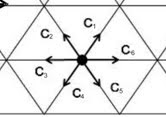
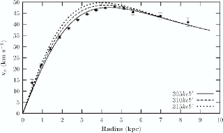
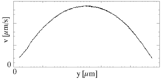
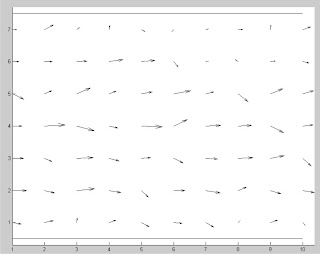

# Papir Automata Gas Kisi

dengan hormat,  
Bergas Bimo Branarto - 6:02 PM Selasa, 10 Agustus 2010

Bayangin partikel kecil, misalkan partikel itu adalah partikel pembentuk air yang berada di dalam sebuah pipa panjang. Trus air ini akan dialirkan horizontal dari kiri ke kanan di dalam pipa. Gerakan aliran air yang biasa kita liat bisa disimulasiin dengan mengasumsikan bahwa gerakan makro (seperti yang biasa kita liat) dipengaruhi oleh gerakan mikro partikel-partikel penyusunnya. Trus sudut pandang ini antara lain diperkuat dengan simulasi komputer.

teori-teori tentang mekanika fluida dihubungkan dengan teori-teori termodinamik dan statistik. dengan pertimbangan-pertimbangan bahwa gerakan partikel, yang dianggap bersifat ideal dan dapat dijelaskan dengan beberapa teori partikel termodinamika (yang penjelasannya jelas pake statistik), akan mempengaruhi gerakan air secara umum yang penjelasannya pake teori mekanika.

Itu teorinya. untuk bagian komputasinya dipake metode, salah satunya sebut aja lattice gas automata atau automata gas kisi. Menurut model gas kisi, sesuai fisika statistik, partikel akan ngisi ruang-ruang siklik yang ada di media, dalam hal ini air. Dalam komputasinya, dibuat kisi-kisi yang berisi ruang kosong yang bisa keisi partikel, kisi-kisi ini disimulasiin sama kondisi-kondisi yang ngisi pixel komputer.

Trus ada partikel bermuatan yang ngisi ruang kosong itu, yang pada kondisi setimbangnya terdistribusi sesuai sama distribusi fermi-dirac. Dalam komputasinya kita buat ada partikel (pixel di komputer) yang memiliki momentum (kita kasih kondisi khusus untuk nyatain momentum) yang punya kemungkinan 6 arah, dan jumlah rata-rata resultan momentum di tiap waktu di program ini akan mengikuti distribusi fermi-dirac. Menurut teori termodinamika, sifat air tuh isotropis soalnya kemungkinan untuk gerak ke segala arah tuh sama besar, untuk model ini sifat isotropis bisa didekati dengan ngasih masing-masing arah momentum di titik kisi dinyatakan berjarak 60o satu sama lain.

oke, di atas tadi tuh syarat-syarat yang diambil dari termo dan fistat. Sekarang kita udah punya kisi dan partikel, kita lanjutin dengan naro partikel acak ngisi tiap titik kisi (ruang kosong yang bisa diisi partikel) dengan rata-rata kerapatan partikel (jumlah partikel di tiap titik kisi) sebesar 2,4 (“air biasanya segini.”, ceuk bu nurul mah). Ini dilakukan dengan memberi kondisi pada pixel komputer yang sebelomnya dinyatain sebagai titik kisi. Jumlah partikel bisa dinyatain dengan ngasih kondisi ‘momentum arah berapa aja yang ada di titik kisi tersebut’ di pixel komputer.

Udah deh.

_Sampai sini, kalo ada yang ngantuk silakan cuci muka dulu, kalo ada yang bosen silakan minggat, kalo ada yang bau silakan mandi. Seduh kopi, nyalain rokok, zikir, stop zikir, tutup mata, teken ujung mata yg deket idung pake jempol dan telunjuk agak kuat, bayangin ada titik cahaya kecil di depan mata kalian lalu bayangin lagi kalian dengan penuh keteguhan hati ngomong “**saya akan tabah!**” trus si cahaya itu makin besar dan makin silau, abis itu segera lepasin tekanan di ujung mata dan langsung buka mata kalian, tarik nafas dalem trus keluarin perlahan sambil nunggu mata menjernihkan dirinya maksimal._

Lanjut lagi.

Tadi gw sempet denger ada pertanyaan “oi! automatanya mana? katanya ini automata gas kisi?!”. Itu pertanyaan yang bagus sekali, nah kita lanjutin ya. tadi kan udah ada tuh gas dan kisinya, sekarang kita masuk ke automatanya nih.

Partikel yang ada di titik kisi akan gerak sesuai momentum yang dia punya sebelomnya. Beliau geraknya dari titik kisi awal ke satu titik kisi terdekatnya yang berada di arah momentumnya.

Di sini kita masuk ke metode cellular automata. Konsep umumnya metode ini tuh self-organizing. Jadi kita bikin aturan-aturan atau syarat-syarat biar si program yang kita bikin ini bisa ngatur dirinya sendiri sesuai syarat yang kita kasih. gile, ini sistem manajemen modern banget ga sih? ‘Otonomi’ ge jiga kitu pan nya.

Yah kita semua tau bahwa tiap gerakan pasti butuh waktu. Waktu. Nah, berarti kalo kita mau bikin program yang ngatur dirinya sendiri, kita mesti ngasih mereka acuan waktu. Acuan waktu ini nantinya kita nyatain sebagai berapa kali program harus looping. Tiap nambah waktu (time step) partikel akan gerak ke satu kisi terdekatnya sesuai arah momentumnya. Pas penambahan waktu berikutnya juga kaya gitu, dan seterusnya.

Bayangin 2 titik kisi yang bertetanggaan. Titik kisi A dan titik kisi B. di titik kisi A ada partikel ke arah titik kisi B, dan sebaliknya. Apa yang akan terjadi kalo jalan cuma muat untuk dilewatin 1 partikel? Tabrakan. Berarti mesti kita buat nih aturan tabrakannya mereka, jadi ntar pas programnya dijalanin mereka udah ngerti buat njalanin aturannya secara otomatis.

Aturan ini pake mekanika, tumbukan 2 atau 3 massa sejenis. Kita terapin kekekalan momentum untuk nyatain kondisi di tiap titik kisi. dibuat perubahan arah momentum yang memenuhi aturan kekekalan momentum, berarti kasih kondisi-kondisi sebagai syarat yang mesti dipenuhi sama program ini. Syarat pertama kalo partikel ada 3, maka arah kecepatan diubah ke arah yang tidak ada sebelomnya. Syarat kedua kalo partikel ada 2, maka arah kecepatan diputer dengan kemungkinan clockwise atau counterclockwise dari arah momentum awalnya.

Berarti ada syarat lagi tuh di dalem syarat kedua (kita simbolin aja syarat’). pada syarat’ itu kita buat bilangan random antara 0 sampe 1. Syarat’ pertama kalo bilangan random kurang dari 0.5 maka puter clockwise, syarat’ kedua kalo sebaliknya maka puter counterclockwise. Syarat-syarat tadi dilakukan dengan syarat jumlah time step ga melebihi yang kita kasih di input.

Sekarang semua partikel di dalam titik kisi udah bisa saling berinteraksi satu sama lain selama input time step. Berinteraksi suka-suka mereka lah selama waktu hidup masih ada, bebas bertingkah sesuai aturan sesama mereka. “oi! tapi mereka juga mesti tau batesan dong, mereka tuh di dalem pipa maka bertingkah lah seperti di dalem pipa!”. Bener banget nih! Kita harus memberi persyaratan untuk partikel-partikel itu biar mereka bertingkah seperti di dalem pipa.

Kita buat lah syarat-syarat bagi semua titik kisi yang ada di tepi atas dan bawah (kalo diliat 2 dimensi) biar partikel-partikel itu mantul balik tiap ada di sebelah tepi. jika arah momentum menabrak tepi maka arahnya diubah sebaliknya, sesuai teori mekanika tentang pemantulan.

Sekarang partikel-partikel itu udah tau diri untuk bertingkah seperti di dalem pipa sesuai metode automata gas kisi.

berikutnya kita mesti bikin aturan untuk nyatain aliran. Air ngalirnya dari kiri ke kanan, berarti tekanan di sisi kiri lebih besar dari di sisi kanan. Menurut mekanika fluida, tekanan juga bisa diliat sebagai gradien momentum (perubahan momentum di tiap posisi) tiap satuan waktu.

Ningkatin tekanan di sisi kiri berarti ningkatin besar vektor momentum ke arah kanan. Di program kita tentuin untuk tiap titik kisi di sisi kiri resolusi, untuk titik kisi yang ga diisi momentum arah 6. ada momentum arah 1 dan ngga ada momentum arah 6 maka momentum arah 1 diubah jadi arah 6. Syarat kedua kalo ngga ada momentum arah 1 dan ada momentum arah 5 maka momentum arah 5 diubah jadi arah 6.

Udah deh.

_Aahhh sampe sini kalo ada yang ngantuk silakan cuci muka, kalo udah bangun setelah tidur barusan silakan seduh kopi, nyalain rokok, ngeunahkeun wae lah meh santay. Ngembang-ngembangin idung, naik turunin alis, lirikin mata kanan kiri, trus tutup mata. teken ujung mata yg deket idung pake jempol dan telunjuk agak kuat, bayangin ada titik cahaya kecil di depan mata kalian lalu bayangin lagi kalian dengan penuh keteguhan hati ngomong “**jalan makin terbentang!**” trus si cahaya itu makin besar dan makin silau, abis itu segera lepasin tekanan di ujung mata dan langsung buka mata kalian, tarik nafas dalem trus keluarin perlahan sambil nunggu mata menjernihkan dirinya maksimal.
Lanjut lagi._

sekarang simulasi udah bisa jalan selama time step yang kita tentuin. Mesti kita cek dulu nih, bener ngga simulasinya udah bener. Kita liat besaran-besaran yang bisa kita dapetin dari program simulasi. Ada posisi, ada momentum.

Kita mesti bandingin besaran-besaran itu sama besaran yang ada di teori mekanika fluida sebagai syarat yang harus dipenuhi untuk dianggap benar. Di mekanika fluida ada posisi, ada gaya. Emang mekanika nih suka gitu, mungkin mottonya “kalo gw dapet posisi, gw bisa gaya”.

Tadi sempet ditulis dikit tentang hubungan momentum sama tekanan. Dan tekanan tuh gaya di luasan tertentu. Jadi kita bisa dapet tuh perbandingan momentum dari program sama dari analitik.

Dari program kita bisa itung berapa jumlah rata-rata momentum di tiap time step. Trus kita liat grafiknya, bandingin sama teori, seharusnya grafik berbentuk seperti distribusi fermi-dirac. kira-kira kaya gini:

Berikutnya kalo kita liat momentum dengan komponen vektor horisontalnya aja, grafik kecepatan terhadap ruang vertikal seharusnya berbentuk parabola. kira-kira kaya gini:

Dengan mbandingin beberapa nilai antara grafik teori dengan grafik simulasi, kita bisa dapet nilai erornya. Sampe 5% masih bisa ditolerir lah ya (bu nurul, tolong ijinkanlah. please, ini syarat untuk kelulusan).

eh lupa, gambar hasil simulasinya kira-kira begini:

hasil run 500 time step

Kesimpulannya mestinya simpel aja lah, bahwa metode lattice gas automata bisa dipake untuk njelasin dan mensimulasiin laju aliran fluida, dalam hal ini air. kesimpulan berikutnya adalah bahwa banyak sekali syarat yang harus diberikan pada partikel agar dia bisa mengorganisir sendiri kehidupannya sebagaimana seharusnya hehehe.

pasti ada lah kurangnya metode ini, antara lain dia ga bisa dipake untuk mensimulasiin aliran fluida tertentu karena  fluida bisa dibedain dengan ngeliat viskositasnya. Dan dengan metode ini, viskositas baru bisa diperoleh pada analisa hasil simulasi, bukan sebagai input. 