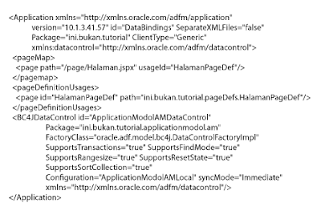
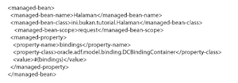
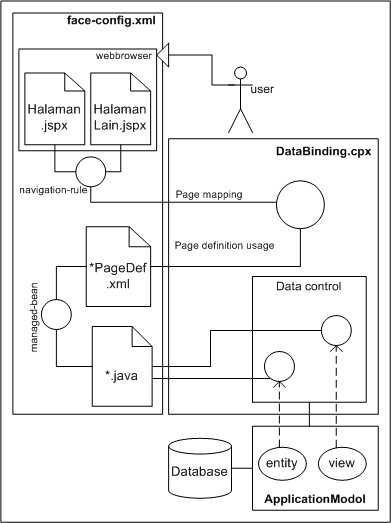
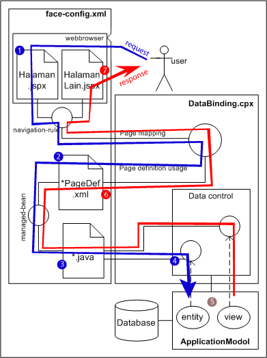

# Petualangan Bersama ADF dan JSF

dengan hormat,  
Bergas Bimo Branarto - 12:34 PM Rabu, 22 Juni 2011

BUTUT (BUkan TUTorial).
entah bener entah salah, yang penting review dulu sebelom lupa :D

baru kenalan sama IDE Oracle JDev dan framework ADF.
jadi apa rupanya ADF itu? Application Development Framework. sebuah framework untuk mengembangkan aplikasi. aplikasi apa? yang lagi gw pelajarin sih pembuatan aplikasi enterprise, pake java ee. dimulai dari tampilan yang akan dilihat melalui web browser, dan berujung pada pengaksesan data di database.

ini adalah sebuah cerita melalui sudut pandang gw tentang sudut pandang ADF dalam mengembangkan sebuah aplikasi web.

di sebuah sisi yang gelap dan berbatu tersebut lah sebuah data di database, dia dikemas dalam sebuah model, boleh lah model ini kita sebut aja ApplicationModul (tidak mesti nama sebenarnya, tapi boleh aja. btw tadi 'model', sekarang 'modul'. bentar lagi 'modol' nih!). baiklah jika demikian, kita gunakan kesimpulan bahwa dia bernama 'ApplicationModol'.

sementara di sisi lain yang meriah dan menarik, yaitu sisi tampilan web browser ada sebuah halaman yang akan menampilkan tabel, atau form atau apa pun lah yang diharapkan dapat terhubung dengan data yang gelap di database. oke lah kita sepakatin aja, ada form untuk menginput data ke database.

yang jadi pertanyaan misterius, apa yang terjadi di antara mereka? siapa yang tega memisahkan (atau justru menyatukan??) mereka? sejauh yang gw perhatiin, gw curiga sebenernya ada pihak ketiga di antara mereka. boleh lah kita sebut dia DataBinding. memang luar biasa si DataBinding ini. gw curiga, sebenarnya dia lah otak dari kerangka kerja ADF.

---

di dalam DataBinding.cpx ada 'pageMap', yang tugasnya nge-list semua page yang akan dipake di dalem aplikasi, trus menyuruh sebuah 'usageId' untuk menyertai tiap halaman tersebut melalui salah satu divisinya, yaitu 'PageDefinitionUsage'. ada sebuah 'halamanPageDef' yang menumpang sama 'usageId' tadi.

berikut contoh kode yang ada di DataBinding.cpx:

kita (mungkin) bisa menganggap bahwa BC4JDataControl (atau kita singkat aja 'DataControl') adalah sebuah perwakilan dari ApplicationModol. dimana ApplicationModol (objek yang ada di dalam package ini.bukan.tutorial.applicationmodol.am) adalah integrasi dari objek entity dan objek view. objek entity adalah perwakilan dari objek (mungkin merujuk ke tabel) di database yang bisa digunakan dalam pengaksesan. sedangkan objek view adalah perwakilan dari field-field di tabel data.

---

sekarang dimana persisnya ada hubungan antara Halaman.jspx dengan class java? di atas tadi kita udah liat hubungan antara Halaman.jspx dengan HalamanPageDef.xml. nah ternyata class java (kita kasih nama aja Halaman.java) bisa berhubungannya sama HalamanPageDef.xml. hubungan ini diaturnya sama face-config.xml. apaan tuh face-config? ternyata itu adalah bantuan dari framework JSF (JavaServer Faces).

ada bagian 'managed-bean' yang fungsinya adalah ngehubungin HalamanPageDef.xml dengan Halaman.java, bagian ini bisa kita liat dari cuplikan kode di face-config.xml ini:

nah sampe sini, kita bisa bayangin tiap data dari input di Halaman.jsx akan dilarikan ke HalamanPageDef.xml oleh DataBinding.cpx. kemudian data itu diterusin sama si HalamanPageDef.xml ke Halaman.java untuk diproses lebih lanjut.

kemudian data dioper lagi ke DataControl di DataBinding.cpx (gw masih belom nemu gimana persisnya proses pelemparan data ini (gw curiganya ada koordinasi yang baik sekali antara JSF dengan ADF di bagian ini, tebakan gw melalui class ValueBinding dan/atau FacesContext (dari JSF) dengan class DCDataControl dan/atau BindingContainer (dari ADF)).

Kalau..  
sekali lagi, kalau.. kerjasama antara JSF dan ADF tadi memang begitu adanya, maka kemungkinan besar DCDataControl lah yang akan meneruskan data ke objek entity ApplicationModol.

sampai di sini, data input dari Halaman.jspx di webbrowser udah sampe di ApplicationModol, dan siap diteruskan untuk meng-update database. sebelum transaksi dilakukan, terlebih dulu DataControl akan mengecek kesesuaian data yang masuk dengan data di database. misalnya, mungkin, apakah input sesuai dengan field yang ada di database, apakah semua field di database yang harus terisi sudah memiliki nilai inputnya masing2, dan seterusnya.

kalau udah oke, maka ApplicationModol yang akan melanjutkan amanah dari pengguna web browser itu untuk meng-update database.

---

sampe sini mungkin baik untuk kita inget lagi bahwa ApplicationModol terdiri dari object entity DAN object view. tadi object entity udah berperan, sekarang dimana peran object view? jangan2 makan gaji buta doang tuh mahluk??

tergantung. tergantung apakah si pengguna minta data di database untuk ditampilin di web browser atau ngga. biar ga magabut (makan gaji buta) akhirnya si pengguna minta data di database untuk ditampilin di webbrowser melalui HalamanLain.jspx.

di sini face-config berfungsi lagi. selain managed-bean, dia juga punya bagian navigation-rule yang tugasnya adalah membaca apa keinginan pengguna melalui sebuah variabel String dan kemudian menyiapkan HalamanLain.jspx untuk menampilkan sesuatu jika variabel String itu terpanggil.

ini cuplikannya dari face-config.xml:

ini artinya tiap ada nilai 'tambahData' disebut dari Halaman.jspx maka HalamanLain.jspx akan  ditampilkan setelahnya.

---

biasanya sih setelah nginput data, pengguna pengen liat keseluruhan data yang ada. maka tugasnya HalamanLain.jspx adalah untuk nampilin data dari database. tadi Halaman.jspx memiliki hubungan dengan DataBinding dan HalamanPageDef, dan begitu juga lah si HalamanLain.jspx. dia punya hubungan dengan HalamanLainPageDef.xml dan juga DataBinding.

tapi hubungan HalamanLainPageDef dengan DataControl di DataBinding.cpx adalah pada bagian view objectnya si ApplicationModol (HalamanPageDef berhubungannya sama object entity) karena tugasnya adalah menampilkan data.

skemanya kurang lebih sama dengan proses di awal tadi (input data), bedanya adalah jika pada saat input data, komponen yang ada di form pada Halaman.jspx menyampaikan data ke HalamanPageDef.xml, sedangkan pada penampilan data, komponen yang ada di tabel pada HalamanLain.jspx memanggil data dari HalamanLainPageDef yang akan memaksa HalamanLain.java untuk memanggil data dari DataBinding yang akan memerintahkan ApplicationModol untuk mengaktifkan object viewnya yang berisi query untuk memanggil data-data di database.

---

proses di atas kurang lebih disesuaikan dengan life cycle umum dari ADF:
1. initialiation
2. restore view
3. apply input request
4. update model value
5. validate model value
6. invoke application
7. render response

---

yang masih jadi pertanyaan adalah:
1. gimana persisnya hubungan class ValueBinding dan/atau FacesContext (dari JSF) dengan class DCDataControl dan/atau BindingContainer (dari ADF)?
2. bener ga sih semua yang gw tulis di atas? :D