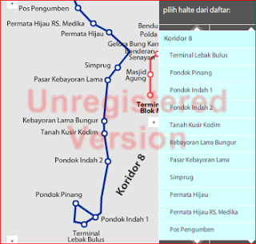
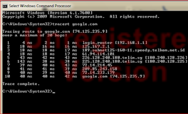

# Something Must Be Written

dengan hormat,  
Bergas Bimo Branarto - 1:28 AM Senin, 23 Juli 2012

something must be written.

_why?_

udah 3 bulan sejak posting terakhir. bahkan posting di bulan april itu pun sebenernya tulisan lama yang udah sekian lama ngendap di draft :D berarti tulisan terakhir adalah 'what a year', desember 2011. 7 bulan! lama juga ya..

_lalu? emangnya knapa juga mesti nulis sering2?_

nulis itu perlu konten. trus konten itu mesti dirumusin dulu biar penyampeannya (agak) enak. perumusan dan penulisan konten itu juga butuh waktu, dan yang paling penting = mood :D

keliatannya ga ada masalah dengan konten. selalu ada konten dimana aja, mulai dari konten kerjaan, perjalanan berangkat/pulang kantor, kehidupan seputar kerjaan (lingkungan kerja, becandaan2 sambil kerja, dll). yang cukup jadi masalah adalah perumusannya. konten yang sama, bisa disampein dengan banyak cara. bisa jadi wadah curcol, atau wadah evaluasi, atau bahkan wadah untuk berbagi tutorial.

gw sih pengennya nulisin evaluasi, biar kesannya keren gitu..

_tapi sampe sini aja kok malah jadi curhat ya?_

suk asu ka ludah.

--

### evaluasi.
> **eva·lu·a·si** /évaluasi/ n penilaian: hasil -- itu hingga saat ini belum diperoleh;
-- penggamakan Min upaya penilaian secara teknis dan ekonomis thd suatu cebakan bahan galian untuk kemungkinan pelaksanaan penambangannya; (http://bahasa.kemdiknas.go.id/kbbi/index.php)

kalo menurut gw, evaluasi itu mbandingin langkah demi langkah yang udah kita jalanin, trus dibandingin dengan 'big picture' atau keseluruhan peta. nyambung sama definisi dari kbbi tadi, dengan mbandingin langkah yang kita ambil dengan keseluruhan peta, kita bisa menilai langkah kita udah tepat atau belom. kita salah langkah atau ngga.

_kerja di dapur. di tempat produksi. sebagai teknisi. ketemunya sama masalah2 teknis. gimana caranya ngevaluasi hal-hal teknis tanpa jadi semacem laporan ilmiah?_

menjelajah di 'dunia baru' banyak nganter untuk ketemu wilayah2 besar yang masing-masing punya 'gaya teknis'nya sendiri2. misalnya programming dan networking. biarpun keliatannya berdekatan, tapi masing2 adalah wilayah yang berbeda, masalah2nya beda, cara nyeleseinnya beda, tools2 yang dipake pun berbeda. tapi ya itu lah konsekuensi logis kalo maen di zona middleware atau perangkat tengah. komunikasi antara 2 aplikasi pasti isinya senggolan2 antara programming dan networking.

coba kita main analogi. entah bener entah salah, yang penting coba digambarin secara general dulu, biar ga terperangkap dalam wilayah detail. menyelam tanpa tau apa yang diselami, cuma nunggu waktu untuk tenggelam. dan kita berusaha menghindari tenggelam :D

_bntar2, gimana taunya kita udah tenggelam atau belom?_

menurut gw, misalnya ada orang nanya sesuatu, dan kita jawab dengan bahasa yang terlalu teknis (bukan bahasa awam) artinya bisa jadi kita udah tenggelam.

--

lanjut, tiap sistem punya prosedur/**program**. jaman sekarang, program yang lagi banyak dikembangin sifatnya 'OOP' (object oriented programming). konsepnya sih, pengolahan data 'dilempar-lempar' antar object yang masing-masing punya fungsi spesifik.

_hati2 tenggelem lu ntar! pake analogi dong!!_

analoginya, misalnya kita beli sate di tukang sate. yang diakses sama pembeli adalah daging. awalnya daging ini (misalnya daging kambing), wujudnya kambing yang ada di peternakan. trus si kambing (masih berwujud kambing) 'dilempar' ke tempat penjagalan. di sini si kambing dengan naasnya disembelih, dikulitin dan dipotong2. trus potongan2nya 'dilempar' lagi ke pasar.

trus potongan daging ini dibeli (misalnya sama istrinya tukang sate) dibawa ke rumahnya, yang dijadiin dapur, ditusuk2, trus disimpen doang atau mungkin dibumbuin. dan kita, dateng ke tukang sate, minta sate. potongan daging yang udah ketusuk2 tadi diambil dari tempat penyimpanan, dibakar, dikemas (disajikan di piring atau dibungkus kertas) dan dikasih ke kita deh.

di analogi itu, yang (mungkin) bisa disebut objek adalah: peternakan, kambing, penjagalan, pasar, istri tukang sate, rumah/dapur, tukang sate, dan kita. 'data' yang diolah/diakses adalah: daging kambing.

kita ambil dua object, kita anggep sebagai sistem. pasar dan rumah.
begitu potongan daging sampe pasar, si pemilik lapak naro potongan2 daging di tempat tertentu, kalo ada pembeli, potongan2 yang dipilih akan ditimbang dan dikasih harga. aktivitas ini adalah prosedur atau program.

program pertama adalah naro potongan di tempat tertentu. tinggal nunggu 'trigger' utk jalanin program berikutnya yaitu ada pembeli.

ga lama istri si tukang sate dateng, milih2 potongan daging, nentuin beberapa yang mau dia ambil. program 'pasar' jalan lagi ke program berikutnya, yaitu ngambil daging2 yang dipilih dan naro di atas timbangan, trus ngasih harga. setelah program ini selesai, terjadi transaksi, dan daging pun berpindah tangan. data pun berpindah object (dari object pasar ke object istri tukang sate).

--

istri tukang sate adalah object yang tugasnya mbawa data (baca: daging) dari pasar ke rumah. object istri tukang sate ini jadi titik persinggungan antara programming dan networking. bayangin istri tukang sate ini naik busway utk pulang-pergi pasar-rumah.

kalo di programming ada OOP, di **networking** ada 'routing'. antara pasar dan rumah, ngelewatin beberapa 'router', bisa kali kita anggep halte. tiap halte bisa dilewatin lebih dari satu trayek angkot. halte tertentu 'tertutup' untuk trayek tertentu, jadi tiap trayek angkot rutenya relatif fix. gitu juga dengan jalur routing network tertentu, ada jalur2nya, diarahin sama network administrator.

kalo pake linux, coba aja ketik di command prompt `traceroute google.com`, atau kalo pake windows ketik `tracert google.com`. nanti akan keluar list url yang dilewatin sama data request kita ke google.com. atau dengan analogi tadi, akan ditampilin list halte2 yang mesti dilewatin antara pasar sampe ke rumah.

_info halte busway -http://www.rutebusway.com/_

_trace route -windows_

mirip kan? :D

permasalahan di networking kira2 misalnya jalur antara terminal lebak bulus sampe pondok pinang macet, lagi jam berangkat kerja. jalur yang disediain ga bisa nampung semua kendaraan yang lewat. kan jalur busway khusus, harusnya ga kena macet dong?? antara terminal lebak bulus dan pondok pinang emang ada jalur khusus busway yg kepisah dari jalur kendaraan biasa? kynya nggak deh. atau misalnya ada bis transjak yang rusak di tengah jalur, berarti bis2 di belakangnya juga terpaksa ikut2an 'ngantre'.

atau kemungkinan problem lain, kalo routernya rusak. atau halte busway tiba2 kebakar. berarti rute bis yang lewat sana mesti dialihkan dulu selama maintenance halte. pengalihannya, kemungkinannya ya jalurnya digabung sama kendaraan2 lain, jadi ikut2an kena macet juga :D

--

itu tadi semua proses di belakang layar.
di depan layar ada user. atau ada pembeli sate. yang fungsinya request dan terima beres.
pokoknya pembeli pengen beli sate, dan yang diharapkan adalah daging yang udah ketusuk dan mateng kebakar, dituker sama duit, lainnya ga urusan.

pas pembeli sate dapet sate yang dia inginkan, berarti bisa kita asumsiin semua proses tadi (baik prosedur2 (ternak, jagal, pasar, dapur) atau network2 (busway)) berjalan dengan lancar.

pas pembeli sate dapet jawaban "maaf mas/mbak, saya ga jualan, dagingnya ga ada..". nah, ini yang mesti diselidiki, dimana letak akar masalahnya kok stok daging kambing ga nyampe ke tukang sate.

semua prosedur atau jalur harus ditelusuri.
1. apakah peternakan udah kekurangan kambing?
2. apakah pejagalan lagi ga produksi? atau masih produksi tapi full fokus ke sapi sehingga kambing2nya dianggurin dulu?
3. apakah pasar lagi ditutup? atau buka tapi lagi janjian ga jual daging kambing?
4. ternak ok, jagal ok, pasar ok. apakah istri tukang sate yang ga pulang2 karena lupa waktu abis maen sama temennya?
5. apakah ada masalah di jalur busway yg dinaikin istri tukang sate?
6. apakah daging di rumah tukang sate hilang/rusak?
7. apakah tukang sate lupa mbawa daging kambing ke tempat jualan?

_"Masalah yang lebih pelik adalah terlalu banyak skenario yang mungkin..." _-http://sains.kompas.com/read/2012/07/09/16133523/Perburuan.Asal.Alam.Semesta

skenario2 di atas bisa disederhanakan jika ada PIC (person in charge) di tiap poin di atas yang **mengecek bagiannya masing2, dan saling melaporkan hasil ceknya dalam satu forum**.

--

ketika akhirnya si pembeli marah, dan mengadu ke pemerintah, "oi! gw mau beli sate aja kok susah amat sih?! kenapa ga ada stok sate di tukang sate yang itu?!" sambil nunjuk tukang sate tadi.

dan pemerintah pun menjawab kepadanya dengan tenang, "oh, ini masalah **sistemik**."  
lalu dia nengok ke belakang, ke arah tukang sate tadi dan bilang "selesaikan secepatnya, gimana pun caranya! ini mengganggu stabilitas negara."

dan tukang sate pun pulang sambil termenung mikirin 7 poin di atas. yang dia tau, poin 6 dan 7 bukanlah masalah sebenernya. tapi gimana caranya ngelacak poin2 lainnya dan nemuin akar masalahnya?

okelah, dimana posisi problemnya, masih bisa ditemukan. poin 3, 4, 5 bisa dikonfirmasikan ke istri tukang sate. poin 1 dan poin 2 bisa dikonfirmasi ke masing2 pihak. tapi untuk penyelesaiannya, apakah tukang sate memiliki semua wewenang untuk menyelesaikan semuanya?

misalnya ternyata ditemukan masalahnya ada di poin 5. ada masalah di jalur busway. ternyata masalahnya adalah traffic yang terlalu padat sampe bis transjak pun terpaksa ikut2an kena macet. mungkin karena misalnya ada banyak kendaraan yang nyerobot ke jalur transjak, dan ikut2an bikin macet jalur itu.

apa yang bisa dilakukan tukang sate untuk menghalangi atau mengurangi kendaraan yang masuk ke jalur busway?

_"tabah ya bang.."_

_"makasih mas.."_